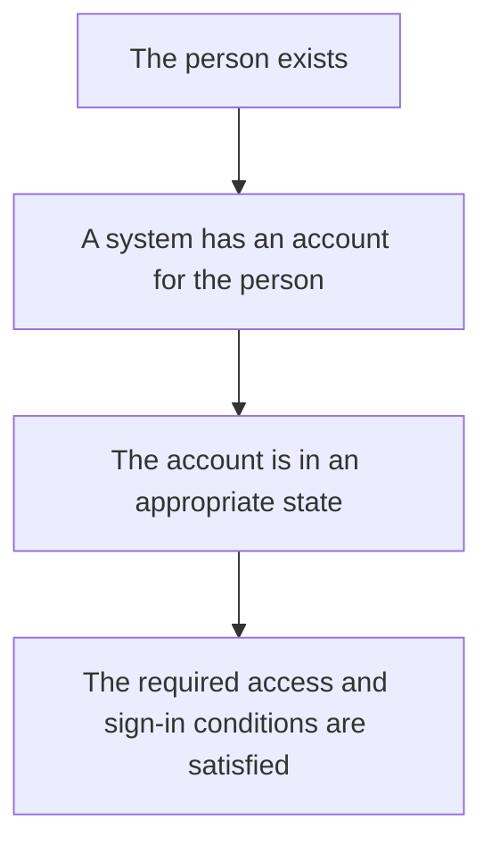
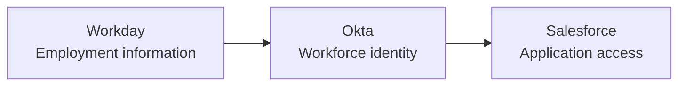
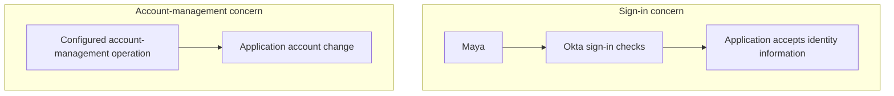
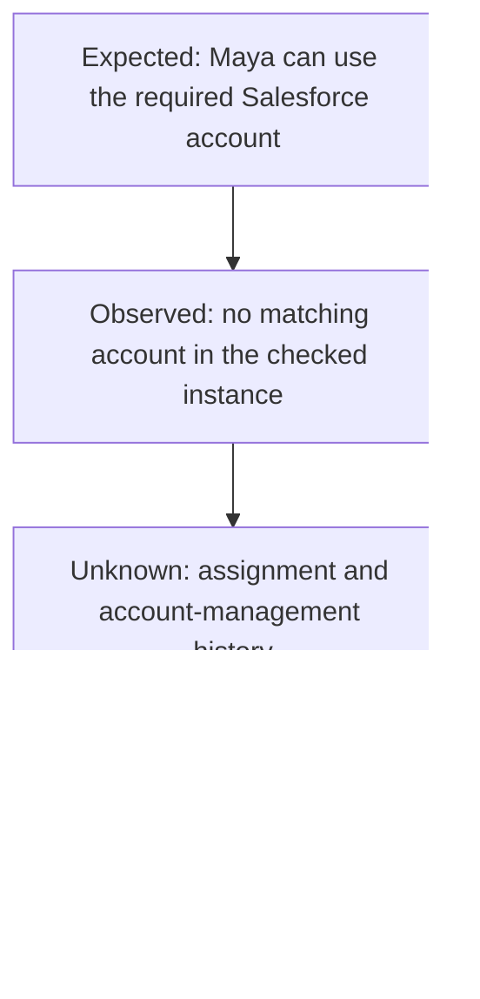

# Day 1: People, identities, and access

Maya Rao has joined the Sales team at Northbridge Services. HR has recorded her employment details. Her manager expects her to start using Salesforce.

Maya opens her laptop, signs in to Okta, and then reports:

> I can sign in to Okta, but I cannot use Salesforce.

Before changing anything, ask yourself: **what does her successful Okta sign-in tell us, and what does it leave unanswered?**

To answer that, we need to separate the person, the records that represent her, and the access she needs.

## Maya is one person; the systems hold different records

HR needs Maya's employee number, department, and manager. Active Directory needs a directory account. Okta needs a user record it can use in its identity and access decisions. Salesforce needs an application account that represents her there.

Those records are connected, but they are not the same object.

| Place | What represents Maya there? | What is it for? |
|---|---|---|
| Workday | Employee record | Employment information, such as her employee number and department. |
| Active Directory | Directory account | Directory-related sign-in and access needs. |
| Okta | Okta user | Her representation in Okta for identity information and access decisions. |
| Salesforce | Salesforce user account | Her representation inside the Sales application. |

Maya does not become four people because four systems contain records about her. Each system represents the same person for its own purpose.

In identity and access management, an **identity** is the representation of who someone is. An **account** is a system-specific record through which that person may sign in or receive access. Some identities represent services or software rather than people; our starting examples follow employees and contractors.

The account can exist without being ready for use. It might be disabled, waiting for activation, or missing a required permission. We therefore need to distinguish:

This is a set of questions to check, not a promise that one step automatically completes the next.

If Maya has an Okta user but no Salesforce account, resetting her Okta password does not create the missing Salesforce account.

## What a directory does

A company needs an organized place to keep information about users. That collection is a **directory**. It can also store groups: collections of users that a company can manage together. Day 5 explains how groups relate to access.

Active Directory, often shortened to **AD**, is one such directory. Northbridge uses it for directory accounts and groups. Okta also keeps identity information in a directory layer called **Universal Directory**.

Think about the useful question each record helps answer:

- Who is this user?
- What is their department?
- What kind of worker are they?
- What groups are associated with them?

The details stored about a user are called **attributes**. Maya's name and department are attributes. A **profile** is the collection of those details for a particular representation of the user.

Here is a small fictional example of information about Maya:

| Detail | Value |
|---|---|
| Name | Maya Rao |
| Employee number | NB-1042 |
| Department | Sales |
| Worker type | Employee |

For now, notice that these are values a system can use, not just information for a person to read. Later, we will follow how department and worker type affect access.

Also keep the source and destination separate. A department value being correct in Workday does not prove it is correct in Okta or Salesforce. You need evidence from the relevant system before making that claim.

## Why Northbridge uses Okta

Northbridge has several applications. Each has its own accounts and access decisions. The company needs a consistent way to connect workforce identity information to application access and sign-in.

Okta helps Northbridge maintain identity information, assign applications, make sign-in decisions, and connect to other systems for supported account-management operations.

Start with this small picture:

The first arrow means that employee information can reach Okta through a configured integration. The second represents the configured relationship between Okta and the application.

The second arrow includes different concerns. One connection can help with sign-in; another capability can manage application accounts. We must not combine those into a vague idea that "Okta takes care of everything."

In Northbridge's main employee setup, Workday supplies HR information to Okta, and Okta connects onward to AD and business applications. The presence of those connections does not guarantee that Maya has been processed successfully through each one.

Priya Shah also works with the Sales team, but she is a contractor. Her identity is maintained in Okta following sponsor approval. The fact that Maya's employee data comes from Workday does not mean every identity in the company must come from Workday.

The important question is always about the particular person and the particular system involved.

## Signing in and having permission are different

Suppose Maya enters her sign-in details and satisfies the required checks. The system accepts that the sign-in is being performed by the expected user.

That process is **authentication**: checking who is signing in.

Now suppose Maya opens an application and tries to perform an action reserved for Finance managers. The application must decide whether she is allowed to perform it.

That decision is **authorization**: determining what the authenticated user is allowed to access or do.

| Question | Concept |
|---|---|
| Is this the expected user signing in? | Authentication |
| May this user access the application or perform this action? | Authorization |

Authentication can succeed while an action is denied. That is not necessarily a broken sign-in. Maya might simply lack the permission required for that action.

Authorization decisions can happen at more than one boundary. Okta can determine whether a user is assigned an application, while the application controls its own features and permissions. An assignment in Okta is not a guarantee that every action inside the application is allowed.

Before deciding how to fix a ticket, ask the user what "cannot access" means. Can they not sign in to Okta? Does the application reject their sign-in? Can they enter the application but not open a particular feature? These observations lead to different investigations.

## SSO helps with sign-in; provisioning manages accounts

Maya does not want to enter separate credentials every time she opens a company application. Northbridge can connect applications to Okta so they use an established identity relationship for sign-in.

That capability is **single sign-on**, usually called **SSO**.

In a representative **federated sign-in**, the application trusts identity information from another system under a configured relationship. Okta authenticates the user as required and sends the application information it can validate. The application then uses that information to complete its own sign-in process. We will examine the messages later.

SSO does not mean that another check will never be required. The application and Okta still have their own sign-in and session requirements.

Separately, Northbridge may need to create Maya's Salesforce account, update information on an application account, or disable an account when employment ends. Managing those account changes is called **provisioning**, with removal or disabling commonly discussed as **deprovisioning**.

These flows can be related without being identical.

An application might have SSO configured while its accounts are created separately. An account might already exist before SSO is connected. An automatic provisioning attempt might fail even though the user can sign in to Okta.

Do not assume Salesforce uses SCIM because another application does. SCIM is an account-management protocol we will explore with Northbridge Projects. For Maya's Salesforce ticket today, we first need the account and assignment facts; the connector details come afterward.

## Being assigned an application is another fact to check

Northbridge needs a way to express which users should receive which applications. In Okta, this includes **application assignments**.

For Maya's ticket, the immediate question is whether Salesforce is assigned to her. How Northbridge manages those assignments comes later; first, keep assignment separate from account creation and successful sign-in.

For today, separate these statements:

1. Maya exists as an Okta user.
2. Maya is assigned Salesforce in Okta.
3. Maya has a Salesforce account.
4. Maya can complete Salesforce sign-in.
5. Maya has the Salesforce permissions needed for her work.

Evidence for statement 1 does not establish statements 2 through 5.

An assignment can trigger configured provisioning, but assignment itself is not proof of successful account creation. Likewise, seeing an application tile is not enough to confirm that all target-account and sign-in conditions are correct.

## Investigating Maya's ticket

Return to Maya's report:

> I can sign in to Okta, but I cannot use Salesforce.

Alex, the identity and access management (IAM) administrator, collects the following information. This is a fictional training snapshot, not a captured production record.

An **identifier** distinguishes a record, such as an employee number or application username. The approved identifier here means the value Northbridge expects to use when finding Maya's Salesforce account; it need not be identical to her employee number. An **application instance** is a particular application environment or configured connection. Checking a test Salesforce environment does not establish what exists in the company's production environment.

| Observation | Evidence available |
|---|---|
| HR has Maya recorded as a Sales employee. | Workday record for employee NB-1042. |
| Maya has an Okta user in Active status. | Her Okta user record. |
| Maya completed the required Okta sign-in checks for this attempt. | A successful sign-in result for the identified attempt. |
| An AD account is associated with Maya. | The directory account association. |
| No Salesforce account matches Maya's approved identifier in the checked application instance. | A target-side account check. |
| Salesforce assignment in Okta has not been inspected. | No assignment evidence collected yet. |
| Provisioning configuration and results have not been inspected. | No account-management evidence collected yet. |

Read the table carefully. **Not inspected** does not mean **not assigned**. **No matching account in the checked instance** does not establish that no similarly named account exists elsewhere.

What can Alex say now?

Maya has an Okta identity, and her reported Okta sign-in is supported by evidence. The check has not established a matching Salesforce account under the expected identifier in that instance. This is an account-matching gap, not yet proof that her account was never created.

Possible explanations include a missing assignment, an account-management process that has not completed, or an identifier mismatch involving an existing account. These are hypotheses, not confirmed causes.

Alex should inspect the expected Salesforce assignment and how Northbridge manages that application's accounts. If automatic provisioning is configured, its relevant result matters. If account creation is handled separately, the responsible process matters. An account match must be established before deciding to create another account.

The investigation follows the first supported difference between expectation and observation:

Resetting her password because she reported an access problem would be guessing. Her successful Okta sign-in already points us toward other unanswered questions for this attempt.

## Apply the distinction to Daniel

Daniel Brooks is a Finance manager. He signs in to Okta and then enters Northbridge Expense successfully. When he tries to approve an expense, the application denies the action.

Does the denial prove his Okta password is wrong?

No. The supplied observations show a successful sign-in and application entry. The unanswered question concerns the approval action: what permission does it require, and does Daniel have it?

His manager title is relevant business information, but it does not prove that the application permission has been granted correctly. Check the application's permission evidence and the approved requirement.

This is why the exact symptom matters more than the broad phrase "access issue."

## Tell Maya's story

Explain this in your own words before moving on:

> Maya is one person represented by different records. HR records her employment information. Okta has a user representing her. AD and Salesforce have separate account responsibilities. Her successful Okta sign-in answers one question, but we still need to check Salesforce assignment, the target account, and application access.

Now change one fact: a Salesforce account already exists, but it is disabled. Which question has been answered, and which questions still need checking?

Do not try to solve it by naming a menu. Explain the facts and the missing evidence.

## Before moving on

Can you explain these without looking up a definition?

- Why can Maya have an Okta user but still be unable to use Salesforce?
- How is authentication different from authorization?
- What does SSO do, and what does provisioning do?
- Why is a correct department value in Workday not proof of the value in Salesforce?
- What is the difference between "not inspected" and "confirmed absent"?
- What additional evidence would help Alex choose a correction for Maya?

Try the [Day 1 reasoning exercises](../exercises/day-01.md), then compare your explanation with the [separate self-check answers](../self-checks/day-01.md).

In [your notebook](../notebook/guide.md), record the five separate statements about Maya's user, assignment, application account, sign-in, and permissions. Add one observation and what it cannot prove.

[Day 2](day-02-requests-and-evidence.md) follows a request between systems and shows how to read evidence from individual steps without mistaking one successful result for the whole outcome.

[Course home](../index.md) · [Northbridge reference](../reference/northbridge-company.md)

