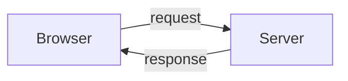
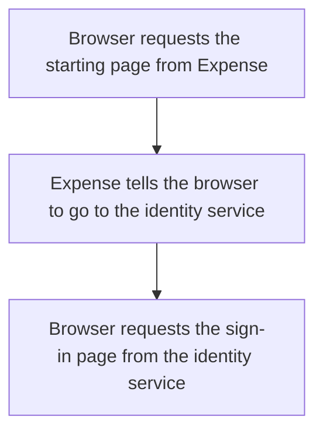
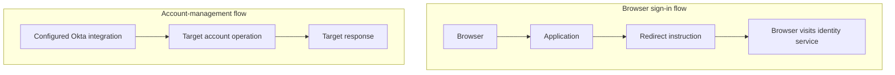

# Day 2: Following a request and reading evidence

Maya opens Northbridge Expense. Her browser takes her to Okta, she completes the required sign-in checks, and she returns to the application. Instead of her expense page, she sees:

> We could not accept the sign-in information. Contact support.

Alex finds an Okta event whose outcome says `SUCCESS`.

Should he tell Maya that everything worked?

Before answering, remember Day 1: signing in, having an application account, and receiving application permissions are different facts. Today, we will follow the messages between systems so we can attach each result to the step it describes.

## Your browser asks; a server responds

When you open a website, your browser asks a system for something: a page, information, or an action. That system replies.

The browser's message is a **request**. The reply is a **response**. The system receiving and handling the request is a **server**.



One page can involve many requests. Loading the page, submitting a form, and retrieving its data need not be the same request.

**HTTP**, short for Hypertext Transfer Protocol, provides rules for these web messages. **HTTPS** is HTTP over an encrypted connection. Encryption protects the communication in transit; it does not prove that the application granted access or that its business operation succeeded.

For each message, ask three questions:

- Who sent it?
- Who received it?
- What was requested, and what did the reply report?

Those questions also apply when two systems communicate without a browser.

## Read the destination before interpreting the result

Here is a fictional address Maya opens. All addresses in this lesson use reserved example domains; they are not live services.

```text
https://expenses.northbridge.example/start?view=home
```

The address is a **URL**. Its parts describe how and where to send the request.

| Part | Meaning in this example |
|---|---|
| `https` | Use an encrypted HTTP connection. |
| `expenses.northbridge.example` | The host being contacted. |
| `/start` | The path requested on that host. |
| `?view=home` | Additional information in the query string: the parameter `view` has the value `home`. |

The query string is information sent with the request. Seeing a value there does not prove the server applied it or changed a stored record.

For Maya's problem, the host matters. A successful response from the Okta sign-in page is not a successful response from Northbridge Expense.

## What the request is asking for

HTTP requests have a **method**, which describes the kind of operation requested.

Two common examples are:

- **GET:** retrieve a resource, such as a page or information.
- **POST:** submit information for the server to process, such as a form or an account-management request.

The method alone does not tell you the business operation. A POST could submit sign-in information or ask an application to create an account. Read the destination and the request's purpose before deciding which flow it belongs to.

Requests and responses can also contain **headers**, which carry message information, and a **body**, which carries content such as form values or returned data. You do not need every header to understand the first example. One will matter for the redirect: `Location`.

## A response can send the browser elsewhere

Northbridge Expense needs Maya to use the configured sign-in connection. It responds with a direction to visit the identity service instead.

This is a **redirect**: the response tells the browser where to go next. The browser then makes another request to that destination.

Look at this simplified training exchange. The paths are fictional explanatory routes, not documented Okta endpoints.

```http
GET /start?view=home HTTP/1.1
Host: expenses.northbridge.example
```

The reply is:

```http
HTTP/1.1 302 Found
Location: https://identity.northbridge.example/signin
```

The `302` is a redirect status. The `Location` header supplies the next address.

The browser follows it and requests the sign-in page from `identity.northbridge.example`, which represents Okta in this example.



The redirect has not created Maya's application account. It has not proved that she authenticated. It has moved the browser to another part of the sign-in flow.

## A status code describes a request's result

The number at the beginning of the reply is an **HTTP status code**.

Start with three results from Maya's example:

| Code | What it tells us | What it does not establish |
|---|---|---|
| `200 OK` | The server successfully handled this request. | That the user authenticated or the whole business process succeeded. A sign-in page or an application-level error page can be returned with 200. |
| `302 Found` | The response directs the client to another location. | That the next destination worked or the user received access. |
| `403 Forbidden` | The server understood the request but refuses to fulfill it. | The exact reason, or necessarily that the user already authenticated correctly. |

If a browser receives `200 OK` when loading a sign-in form, the form loaded. The user might not have entered any credentials yet.

If the application returns `403`, we need its response details and related evidence. Do not automatically translate that into "wrong password" or "missing role."

You do not need to memorize the full status-code catalog. Start by identifying which request received the response.

## Follow Maya's attempt one step at a time

The following is a synthetic training timeline. It shows selected observations, not every network request in a real integration. Sign-in messages and their validation will be examined in the federation lessons.

| Step | Observation | What is established? |
|---|---|---|
| 1 | Browser requests `/start` from Northbridge Expense. | An application request was made. |
| 2 | Expense replies with `302` and an identity-service location. | The browser was directed to the sign-in service. |
| 3 | Browser requests that sign-in page; it receives `200` and a sign-in form. | The form loaded. Authentication is not established by this response. |
| 4 | Maya completes the required sign-in interaction. | The example includes a completed sign-in interaction; the response from Step 3 alone did not prove it. |
| 5 | Okta records an application SSO event with outcome `SUCCESS`. | Okta recorded success for that SSO event. |
| 6 | The browser reaches the application's sign-in return route; the application replies `403` with the rejection message. | The checked application request was refused. The message reports a sign-in-information rejection. |

Where is the first **demonstrated failure** in this packet?

It is the application refusal at Step 6. That does not prove the underlying defect originated in the application. The application might reject information produced earlier in the flow. We need more evidence to identify the cause.

Alex should obtain the application's rejection details and the relevant sign-in exchange for the same attempt. Later lessons will explain which protocol fields to compare. Today, the important distinction is between **where a failure is observed** and **what caused it**.

## Read an event as a sentence first

Okta's **System Log** records events about activity in the Okta environment. An event records a particular action and result; it does not automatically report everything that happened in a separate application.

Before looking at a record, translate it into ordinary language:

> Maya attempted SSO to Northbridge Expense, and Okta recorded that event as successful.

Here are the fields behind that sentence:

| Field | Question to ask |
|---|---|
| `eventType` | What kind of event was recorded? |
| `actor` | Which user, system, or other actor is associated with the action? |
| `target` | Which object or objects are involved? |
| `outcome.result` | What result did this event record? |

The actor is not always the person named in the original ticket. An administrator or automated process may act on someone else's account. Targets can include several objects, so inspect the relevant entries rather than assuming there is exactly one.

This synthetic excerpt contains only selected fields. The event type is documented by Okta; the people and values are fictional.

```json
{
  "eventType": "user.authentication.sso",
  "actor": {
    "displayName": "Maya Rao"
  },
  "target": [
    {
      "type": "AppInstance",
      "displayName": "Northbridge Expense"
    }
  ],
  "outcome": {
    "result": "SUCCESS"
  }
}
```

This format is **JSON**: named fields and their values. Braces group fields into an object. Square brackets hold a list, such as the `target` list. You are reading the information, not writing an integration.

`outcome.result` means the `result` field inside `outcome`. The result belongs to the event named by `eventType`, with the actor and targets shown. It does not erase the later application's `403` observation.

The excerpt also lacks the identifiers and timestamp needed to independently connect it to a specific request. In the supplied timeline, the matching attempt is stated as part of the training evidence. In an incident, Alex must establish that connection using the actual records; a matching display name is not enough.

## Match the evidence to the right attempt

Suppose another record has `SUCCESS`, but its actor is Priya Shah. Or it concerns Maya opening a different application. Neither establishes the outcome of Maya's reported Expense attempt.

Check the person, application instance, relevant attempt, and available identifiers. Compare timestamps and their time zones as well: events from different attempts can have the same person and application. An **identifier** is a value used to distinguish a particular object, request, or event. Display names can repeat; object identifiers help distinguish records.

Do not assume Okta and the application automatically share one identifier. Connecting their observations may require request context, application-side references, and a consistent sequence. Detailed correlation belongs later; the habit starts now.

## A remembered sign-in is not an account

Maya returns to a website and is not immediately asked to sign in again. The website may recognize a previously established **session**: state associated with an ongoing interaction.

A **cookie** is a small piece of data a website can ask the browser to store and send back on matching requests. A session cookie commonly helps the server associate a request with session state. Not every cookie represents a sign-in session.

Keep these separate:

- The account is the system's record representing Maya.
- The session concerns an established interaction.
- The cookie is browser-held data that may help identify that interaction.

Removing a browser cookie does not delete Maya's employee record or application account. Likewise, an existing cookie does not prove that a session remains valid; the server and relevant requirements still matter.

An Okta session and an application's session are also separate. For now, recognize that evidence from one does not settle the state of the other. Their policy and lifecycle behavior comes later.

## Compare a redirect with account management

A redirect asks the browser to visit another address as part of a web flow.

A provisioning request asks a target system to perform an account-management operation, such as creating or updating an account. The systems can exchange that request without Maya's browser carrying it.

An **API** is an interface through which software can ask another system for information or an operation. Many web APIs use HTTP requests and responses. A browser opening a sign-in page and Okta sending an account-management request are both message exchanges, but they solve different problems.



A POST does not identify which flow is happening by itself. Nor does a successful browser redirect prove a provisioning operation occurred. Read who communicated, the destination, and the purpose.

<details>
<summary>Supporting reference: DNS and two additional response codes</summary>

A host name normally needs to be resolved to a network address before the connection can be made. **DNS**, the Domain Name System, helps with that lookup. If name resolution fails and no connection is established, you may have no HTTP response from the application at all. An error displayed by the browser is not automatically an application response.

Two other codes will appear in later examples: `400 Bad Request` indicates a problem with the request, and `401 Unauthorized` indicates a lack of valid authentication credentials for the requested resource. Despite its name, 401 concerns authentication; 403 is a refusal whose cause needs context.

These details are useful when a later incident concerns connectivity or an API response. Maya's present timeline can be explained using the destination and the 200, 302, and 403 observations already shown.

</details>

## Before moving on

Explain these in your own words:

- What is a request, and what is a response?
- Which part of the URL tells you the host being contacted?
- What does a `302` with a `Location` header ask the browser to do?
- Why can a sign-in form return `200` before authentication happens?
- What does the SSO event's `SUCCESS` prove, and what remains unknown?
- Why is a cookie different from an account?
- Why must Alex match the person, application, and attempt before using an event as evidence?

Try the [Day 2 reasoning exercises](../exercises/day-02.md), then use the [separate self-check answers](../self-checks/day-02.md).

In [your notebook](../notebook/guide.md), write Maya's request sequence. For each response or event, add a sentence beginning "This proves…" and another beginning "This does not prove…" Identify the evidence needed to investigate the application refusal.

[Day 3](day-03-profiles-and-mappings.md) follows identity values between profiles and shows how a correct source value can become a different value elsewhere.

[Previous: Day 1](day-01-people-identities-access.md) · [Course home](../README.md)

