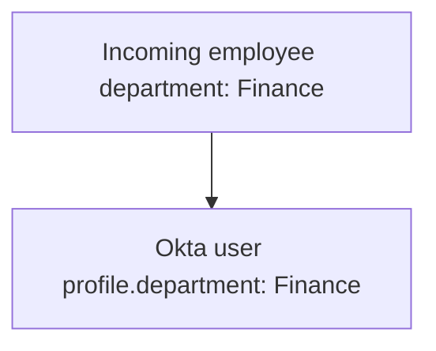
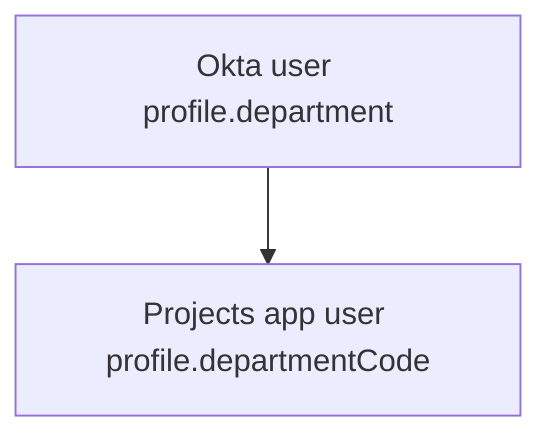
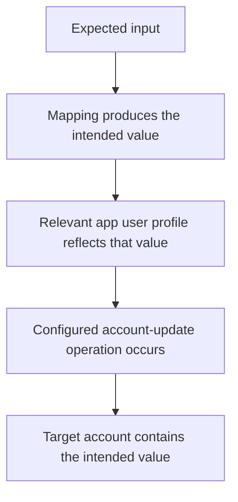

# Day 3: Profiles, attributes, and mappings

Daniel Brooks is a Finance manager at Northbridge Services. Workday correctly places him in Finance. His Okta profile also says Finance. Northbridge Projects, however, displays his department as Sales.

Daniel reports:

> My department is correct in HR. Why is Projects showing something different?

Before deciding where to make a correction, follow the value between systems. Day 1 separated the person from the accounts representing them. Day 2 separated individual observations from the whole outcome. Here, those habits help us find where identity information changes.

## Start with one piece of information

Daniel's department is an **attribute**: one named piece of information about him. The value of that attribute is `Finance`.

A **profile** holds a collection of attributes. Daniel's name, employee number, and department can appear together in his Okta user profile.

Here is a fictional profile excerpt:

```json
{
  "firstName": "Daniel",
  "lastName": "Brooks",
  "employeeNumber": "NB-1020",
  "department": "Finance"
}
```

Read `department` as the field name and `Finance` as its value. The excerpt contains selected profile fields, not the entire Okta user object.

A user object also has information outside its profile, such as its object identifier and account status. An Active status is not a department attribute, and changing a department is not the same operation as activating an account.

When investigating, be precise about the object and field you mean. "Daniel looks correct" is less useful than "Daniel's Okta user profile has `department = Finance`."

## The profile describes a user; the schema describes the fields

How does a system know which attributes are allowed and what kind of values they can hold?

That definition is a **schema**. It describes the structure of the profile: field names, types, and requirements.

For example, a schema might specify that an employee number is text and a particular field is required. A company can also need custom attributes in addition to the attributes provided by the product. The available fields and constraints depend on the profile and integration.

Compare these two questions:

- **Schema question:** Does this profile support a department field, and what values may it contain?
- **Profile-value question:** What department value does Daniel have in that field?

Adding a field to a schema does not automatically give every user a correct value. A value must come from the applicable data source or maintenance process.

The reverse matters too. A value can be readable text but still be unacceptable to the destination. An application expecting a department code might reject a full department name.

## There is an Okta user profile and an application user profile

Daniel has an Okta user profile in Universal Directory. Okta also represents the information associated with his assignment to a particular application in an **app user profile**.

The app user profile is in Okta. It is not the same record as Daniel's account stored inside Northbridge Projects.

| Layer | Where it is | What it represents |
|---|---|---|
| Workday employee record | Workday | Daniel's employment information. |
| Okta user profile | Okta | His central workforce profile in Okta. |
| Projects app user profile | Okta | The application-specific attributes associated with his Projects assignment. |
| Projects account record | Northbridge Projects | The account and values actually stored by the application. |

Why have an application-specific profile? Different applications can need different field names, formats, and values. One application may use a department name; another may need a code.

Seeing a correct Projects app user profile in Okta therefore does not, by itself, prove that the Projects account has been created or updated successfully. You still need evidence from the account-management operation and destination.

## A mapping connects a source field to a destination field

Suppose Workday supplies Daniel's department and Northbridge wants that value represented in Okta.

The integration needs a defined relationship between the incoming field and the receiving field. That relationship is an **attribute mapping**.

At its simplest, the mapping copies a value:



The labels here describe the intended data flow; they are not instructions or exact Workday connector field names.

Another mapping can take a value from the Okta user profile and prepare the value required by an application's profile.



Always name both sides. "The department mapping" is ambiguous when several systems and profiles are involved.

## Direction changes the meaning

For a particular integration, **App to Okta** means the connected application or directory supplies values to the Okta user profile. **Okta to App** means the Okta user profile supplies values toward the application's profile.

The word *app* in the mapping interface can refer to an upstream source integration as well as a downstream business application. It does not automatically mean "the application the employee is trying to open."

| Mapping direction | Question it answers in this example |
|---|---|
| Workday to Okta | How is HR department information represented in Daniel's Okta profile? |
| Okta to Projects | How is Daniel's Okta department represented for Projects? |

A mapping in one direction does not automatically define the reverse direction. It also does not mean a value is constantly synchronized in every circumstance. The integration's supported operations and update configuration still matter.

Day 2's request habit applies here: identify where information comes from and where it is meant to go before interpreting the result.

## A correct mapping can change the value

Northbridge Projects is a fictional application with this department-field requirement:

| Accepted `departmentCode` | Displayed department |
|---|---|
| `SAL` | Sales |
| `FIN` | Finance |
| `IT` | IT |

For this example, the field is required, and these are its accepted codes. These are Northbridge Projects rules, not universal Okta or SCIM requirements.

Workday and Okta use the full name `Finance`. Projects expects `FIN`. A mapping must therefore convert the value into the destination's format. This is a **transformation**.

The intended rule is:

```text
If the Okta department is Sales, produce SAL.
If the Okta department is Finance, produce FIN.
If the Okta department is IT, produce IT.
If it is missing or unrecognized, flag it for review.
```

This is plain-language rule logic, not Okta Expression Language code. An expression is a formula that calculates a value from its inputs; Okta Expression Language supplies syntax for such formulas. An expression can calculate the code, but a review or notification process must be defined separately. The words "flag it for review" do not mean that a mapping automatically opens a ticket.

For Daniel, predict the output before reading on: the input is Finance, so the intended output is FIN.

The two values are different strings, but they carry the same meaning under the application's defined code table. Comparing values correctly means checking their intended meaning, not demanding identical text everywhere.

## Find the first wrong representation

Alex gathers the following synthetic evidence for Daniel. The observations refer to the same user, the same Projects integration, and the account linked to that assignment. The preview is evaluated with the listed input.

| Boundary | Observed value or behavior |
|---|---|
| Workday employee record | Department: Finance. |
| Imported Okta user profile | `department = Finance`. |
| Configured Okta-to-Projects rule | Always produce the fixed value `SAL` for `departmentCode`. |
| Mapping preview for Daniel | `departmentCode = SAL`. |
| Projects app user profile in Okta | `departmentCode = SAL`. |
| Projects account record | Stored code SAL; displayed department Sales. |

Where does the first wrong representation appear?

The source and Okta user profile agree with the approved requirement. The configured outbound mapping produces SAL even though Daniel is in Finance. The preview demonstrates that wrong output, and the app user profile and target contain it too.

The problem is not that Projects displays the label Sales for SAL. According to its code table, that display is correct. The incorrect value was prepared earlier.

Alex has evidence of a mapping defect: the fixed value conflicts with the intended conversion. He can propose replacing that constant with the approved department-to-code logic, while checking which other users share the mapping.

Be careful about what is still unknown. These snapshots do not establish the complete history of how the target obtained SAL. That historical claim would require the relevant operation evidence. They do establish that the current mapping produces the wrong value for the stated input.

Changing Daniel's Workday department would not be an appropriate correction: the evidence says the HR value is already correct.

## A preview is a calculation, not delivery evidence

After the proposed correction, suppose a preview produces FIN for Daniel.

What has been shown? The mapping evaluated to the expected value for that input.

What has not been shown? That the configuration was applied, that existing app user values were updated, that a target update was attempted, or that Projects accepted and stored FIN.



Each step requires its own evidence. A preview does not perform the entire chain for you.

Now consider another packet:

| Observation | Value |
|---|---|
| Okta user department | Finance |
| Mapping preview | FIN |
| Projects app user profile | FIN |
| Projects account | SAL |
| Target update result | Not supplied |

This packet points to a different unanswered boundary: the value prepared in Okta has not been demonstrated to reach the target correctly.

Ask whether updates are supported and enabled for that attribute, whether an update was attempted, what response it received, and whether the inspected target is the linked account. Do not claim a specific connector failure without the result. Do not assume saving a mapping means all existing accounts were updated.

## Recognize a verified correction

Here is a separate synthetic follow-up for Daniel after the approved mapping correction. All observations concern his linked Projects account, and the target check follows the recorded update.

| Evidence | Result |
|---|---|
| Saved mapping evaluated with Finance | FIN |
| Projects app user profile in Okta | FIN |
| Account-update record for the linked target | Department code FIN sent; target reports success |
| Target account read after that update | FIN, displayed as Finance |

Together, these observations support a successful department correction for Daniel at the checked point. They do not establish the outcome for every other user sharing the mapping. Those users need an appropriately scoped check too.

## Missing data needs a decision

Suppose the incoming department has no value. Should the mapping use Sales because most employees are in Sales?

That would invent business information. Under Northbridge's rule above, missing or unrecognized values are flagged for review.

These examples also have different meanings:

| Representation | What you can observe |
|---|---|
| `"department": "Finance"` | A supplied text value. |
| `"department": ""` | An empty string. |
| `"department": null` | An explicit null value. |
| No `department` field in a selected excerpt | The excerpt does not show the field. |

Do not assume these cases behave identically in every integration. A field omitted from an excerpt may simply have been left out of the evidence. A missing input also does not prove that Okta will automatically choose another source or clear an existing destination value.

The correct next question is what the source actually contains and how this mapping and update operation handle that condition.

## Mapping and ownership answer different questions

A mapping explains **where a value goes and how it is transformed**.

Attribute ownership explains **which system is allowed to control that value**.

For Daniel's HR department, Northbridge has chosen Workday as the controlling source. The mapping into Okta expresses how that data is represented there. A later mapping prepares the application-specific code.

The existence of a mapping does not, by itself, settle competing source ownership or authorize a manual edit. Those questions become especially important when Workday, AD, and Okta-managed users coexist. Day 4 examines that decision explicitly.

## Tell Daniel's story

Explain the complete flow in ordinary language:

> Daniel belongs to Finance in the HR record. His Okta user profile also contains Finance. Projects needs a department code, so an outbound mapping prepares an application-specific value in Okta. The intended value is FIN. The target account must then receive and store that value through the configured update process.

Add the failure: the current mapping always returns SAL. Where should Alex investigate, which input should remain unchanged, and what evidence would confirm a successful correction?

Then change the condition: the mapping and app user profile now contain FIN, but the target still contains SAL. Explain why the next investigation is different.

## Before moving on

Can you explain:

- The difference between an attribute, its value, a profile, and a schema?
- Where the Okta user profile, app user profile, and target account live?
- Why mapping direction must be stated explicitly?
- Why Finance becoming FIN can be correct?
- What a correct preview proves and what it leaves unverified?
- Why an omitted field is not automatically proof of an empty source value?
- How mapping differs from ownership?

Try the [Day 3 reasoning exercises](../exercises/day-03.md), then compare with the [separate self-check answers](../self-checks/day-03.md).

In [your notebook](../notebook/guide.md), draw the four data layers and label each observed value. Record the first proven discrepancy and the additional evidence needed to verify delivery to the target.

[Day 4](day-04-sources-and-ownership.md) asks who controls the profile and individual attributes when more than one source is connected.

[Previous: Day 2](day-02-requests-and-evidence.md) · [Course home](../README.md)

