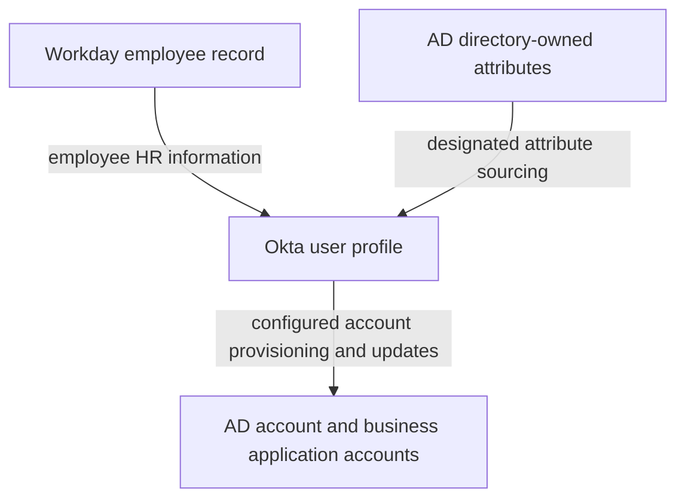
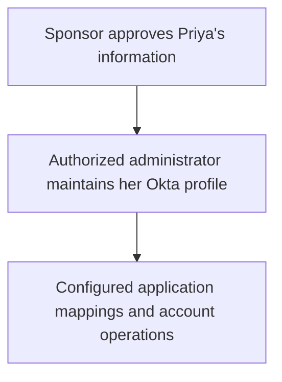
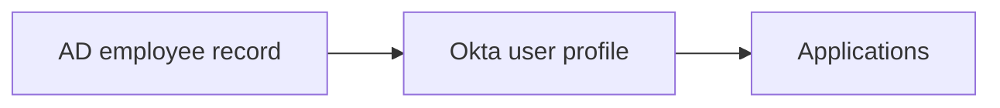

# Day 4: Sources, priority, and ownership

Maya Rao is still a Sales employee at Northbridge Services. Workday says Sales, but an AD record says Finance. Priya Shah is a Sales contractor whose department is maintained in Okta after her sponsor approves it.

Alex receives two questions:

> Can we fix Maya's department directly in Okta? And why can we maintain Priya's department there if Workday is our source?

The answer starts with which source applies to each person and which source controls the particular field. A value being visible in Okta does not make Okta its owner.

Your goal is to identify who controls a particular person's department or email before deciding where a correction belongs.

## Start with authority

Day 3 followed a value through profiles and mappings. A mapping describes where a value goes and how it changes format. It does not decide whose version the company trusts.

A **profile source** is the system designated to control a user's profile. Older material may call this a profile master. A user has one effective profile source at a time, although individual attributes can have separately designated sources. Okta's [profile sourcing documentation](https://help.okta.com/oie/en-us/content/topics/users-groups-profiles/usgp-about-profile-sourcing.htm) makes this distinction important when several sources are connected.

Think of two questions:

- Who normally controls this person's profile?
- Does this particular attribute follow that source, or have an explicit source of its own?

You need both answers before proposing a correction.

Here, **authority** means the responsibility to control the data; it does not mean every value in that system is correct. A wrongly recorded department can still need correction in its authoritative system. **Topology**, in the next section, means the arrangement of systems and the directions information travels between them.

## Northbridge's employee topology

For employees, Northbridge uses this arrangement:

Workday is the employee profile source. AD is a downstream account destination and also supplies designated directory-owned attributes back to Okta. These roles can coexist because they describe different responsibilities and directions.

This diagram is a statement of Northbridge's architecture. It does not mean every field moves both ways or that an account operation has succeeded. Each arrow needs its own supported configuration and evidence.

Northbridge's external profile-source order is:

| Priority | Designated source |
|---|---|
| First | Workday |
| Second | Active Directory |

**Source priority** is the configured order used when more than one designated source applies to a user. Okta supports ordering designated apps and directories on its [Profile Sources page](https://help.okta.com/oie/en-us/content/topics/users-groups-profiles/usgp-prioritize-profile-source.htm).

That order is not a rule saying that Workday controls every identity merely because the integration exists.

## First ask which sources apply to this person

An **import** brings records or changes from a connected system into Okta for processing. **Matching** determines whether an incoming record represents an existing Okta user. A **source association** links an Okta user to their record in a source integration. Import and matching processes help establish those links. Having similar names in two systems is not enough evidence that their records are correctly linked.

**Import scope** is the set of records the integration is configured to include. Selecting employee records for import does not mean every contractor or administrative identity is included too. Scope determines which records enter processing; matching determines their proposed relationships with Okta users.

For the following fictional evidence, the associations have been checked:

| Person | Workday association | AD association | Effective profile source |
|---|---|---|---|
| Maya, employee | Present | Present | Workday |
| Daniel, employee | Present | Present | Workday |
| Priya, contractor | None | None | Okta |
| Alex's administrative identity | None | None | Okta |

Maya has both employee associations. Workday is above AD, so Workday is her effective profile source. Priya has neither external association, so the employee source order does not make Workday her source.

For an investigation, read the association evidence before applying the priority list. Do not infer an association from a department, a contractor label, or the fact that a connector is enabled.

Nor does second place mean that AD is an automatic emergency substitute whenever Workday is unavailable. A failed import, an empty field, and a change of source association are different conditions. None alone proves that source ownership has changed.

## Then check the particular attribute

Northbridge defines these employee ownership rules:

| Attribute | Controlling source for Maya | Intended flow |
|---|---|---|
| First name and last name | Workday | Workday to Okta |
| Department | Workday | Workday to Okta, then configured downstream mappings |
| Work email | AD, explicitly designated at attribute level | AD to Okta |

**Attribute-level sourcing** lets a field have a designated source different from the overall profile source. Okta's [attribute sourcing documentation](https://help.okta.com/oie/en-us/content/topics/users-groups-profiles/usgp-about-attribute-sourcing.htm) describes a Workday/AD/Okta example of this kind. The sourcing decision concerns the Okta user profile; an app user profile still has its own mapping and delivery considerations.

For Maya, Workday first does not mean “ignore AD for every field.” It means Workday controls her profile, with the stated work-email exception.

The field's source setting explains the mechanism. **Inherit from profile source** means the field follows the user's effective profile source. **Inherit from Okta** designates Okta for the field. **Override profile source** designates another source for that field. These are ownership choices, not mapping formulas. See [Okta's attribute source definitions](https://help.okta.com/oie/en-us/content/topics/users-groups-profiles/usgp-define-attribute-profile-source.htm).

Northbridge's department field inherits from the profile source: Workday for Maya, Okta for Priya. It is not globally pinned to Workday for every user. The explicit AD work-email exception is separate from that inherited department behavior.

Northbridge also avoids writing AD-owned email back to AD from a competing Okta-to-AD mapping. Otherwise an older value could be written back over the value AD is supposed to control. An arrow in each direction is not permission to have both systems overwrite the same field.

When asking which source wins, identify the field's sourcing configuration and the applicable source order. Do not collapse all those decisions into a single global ranking.

For Northbridge's work email, the evidence explicitly designates AD. We have not specified a rule that substitutes Workday's email when AD has no value. That behavior would need separate configuration evidence.

Use this order when reading the examples:

| Question | Maya's department | Maya's work email | Priya's department |
|---|---|---|---|
| Which sources apply to this user? | Workday and AD | Workday and AD | Okta-managed; no external associations |
| Which profile source applies after priority? | Workday | Workday | Okta |
| Does this field inherit or have an explicit source? | Inherits from profile source | Explicit AD source | Inherits from profile source |
| Where does the expected value come from? | Workday | AD | Approved Okta maintenance |

That sequence identifies the expected owner. Comparing the actual values and operation results is the next step; ownership alone does not prove delivery.

## Work through the disagreement

Alex collects this synthetic packet for the same linked Maya records. Workday's Sales department is confirmed as the approved business value; no department move has occurred.

| Field | Workday record | AD record | Okta user profile |
|---|---|---|---|
| Department | Sales | Finance | Sales |
| Work email | `maya.rao@northbridge.example` | `mrao@northbridge.example` | `mrao@northbridge.example` |

The addresses are fictional. Different text is not enough to establish an error.

For department, Okta reflects the designated Workday value. AD disagrees, but its lower-priority department value does not override Workday in this configuration. Investigate how AD's department is maintained and whether the intended downstream update reached it. Do not change the correct Okta value to Finance just to make the records agree.

For work email, Okta reflects the explicitly designated AD value. The different Workday address does not, by itself, show a defect. First compare the value against the approved email requirement and attribute ownership.

Work email is also distinct from the Okta login and an application's username. Those fields may use different values under their own mappings. The [company's identifier comparison](../reference/northbridge-company.md#keep-mayas-identifiers-separate) keeps the later examples separate from this email-ownership decision.

The department snapshots show a disagreement. They do not prove whether an update was skipped, failed, or followed by another write. That history needs operation evidence.

## What if Maya's Okta department were wrong?

Consider a separate packet: Workday says Sales, Okta says Finance, and the checked ownership still says Workday controls department.

Alex should investigate the source association, incoming mapping, applicable import or update, and its result. A source designation expresses authority; it does not prove the latest value arrived successfully.

If HR itself had the wrong approved value, the correction should follow the HR maintenance process. If HR is correct but Okta is stale, changing HR to compensate would damage the authoritative record.

A direct Okta edit is not a durable general solution for an externally controlled attribute. Editability depends on the field's configuration, and a later source update may replace a locally changed value. Being an administrator does not settle which business system should own it.

## Why Priya can be maintained in Okta

Northbridge's contractor process is deliberately different:

Priya has no Workday association and no AD account assignment. Employee imports exclude her population. Her profile and department are Okta-managed under Northbridge's maintenance rules.

The sponsor's approval is a business decision. The sponsor is not another technical profile-source integration, and approval does not imply permission to edit Okta directly.

This explains why the same administrator can appropriately maintain Priya's department in Okta while routing a correction to Maya's authoritative employee data through HR.

The contractor label alone does not enforce separation. Alex must be able to establish import scope and actual associations. If an imported record is accidentally matched to Priya, her intended architecture is no longer enough to explain the observed configuration. Review the unexpected link and its effects before changing priorities or data. Detailed matching comes later.

## Field ownership and account lifecycle are separate decisions

A user's **lifecycle** includes joining, changing responsibilities, and leaving. Workday employment events drive Northbridge's configured employee account-state changes. Priya's engagement changes follow the sponsor-approved Okta maintenance process.

Giving AD ownership of Maya's email does not give it authority over her employee lifecycle. Lifecycle settings must support the intended architecture separately from attribute sourcing. Source priority alone also does not prove which accounts or sessions have been disabled. Day 12 examines those outcomes.

## Keep the AD-led variation separate

Another company might use an AD-led arrangement:

In this variation, AD is the applicable profile source and there is no applicable Workday source for the employee. AD can therefore control department through the configured incoming mapping.

That does not contradict Northbridge's Workday-led model. The source associations and ownership decisions differ. Always name the architecture before carrying conclusions from one example into another.

Do not reorder Northbridge's sources to imitate this variation as a quick fix for one stale field. Changing priority is an ownership decision that may affect many associated users.

## Profile ownership does not identify the password validator

Maya can have a Workday-sourced profile while AD validates her password on Northbridge's configured AD password sign-in path. The **Okta AD agent** is software running in the company's environment that connects Okta to AD for supported operations.

Those facts answer separate questions:

| Question | Northbridge answer for Maya |
|---|---|
| Who controls the overall employee profile? | Workday |
| Who controls work email? | AD, through the explicit attribute source |
| How does department become an application's code? | The relevant mapping and transformation |
| Who checks the password on the AD password path? | AD, reached through Okta's AD agent |

The password validator checks a credential. It does not thereby become the owner of HR department data. Likewise, a successful profile update does not establish that the password path is healthy. Day 6 follows that path in detail.

## Tell Maya's and Priya's stories

Explain why Maya's Workday association and source order matter before interpreting her department. Then explain why AD can supply her work email without becoming her overall profile source.

For Priya, name the missing external associations, the employee import exclusion, and the authorized Okta maintenance process. “She is a contractor” is a description, not the complete mechanism.

Finally, add Day 3's delivery distinction: even a correctly owned and mapped value must still be verified in its destination.

## Before moving on

Can you explain:

- Why source priority must be read alongside a user's associations?
- How one profile source can coexist with a different source for a particular attribute?
- Why AD's department does not win for Maya in the supplied packet?
- Why Priya's profile can be maintained in Okta?
- Why a missing value does not establish automatic fallback?
- Why a mapping and a password validator are different from a profile source?
- What evidence distinguishes incorrect ownership from an update that has not reached its destination?

Try the [Day 4 exercises](../exercises/day-04.md), then use the [self-check answers](../self-checks/day-04.md).

In [your notebook](../notebook/guide.md), annotate the data flow with the person, source associations, effective profile source, field owner, and mapping direction. Leave operation results marked unknown when no evidence supplies them.

[Day 5](day-05-groups-and-assignments.md) connects these identity attributes to groups and application assignments.

[Previous: Day 3](day-03-profiles-and-mappings.md) · [Course home](../index.md)
