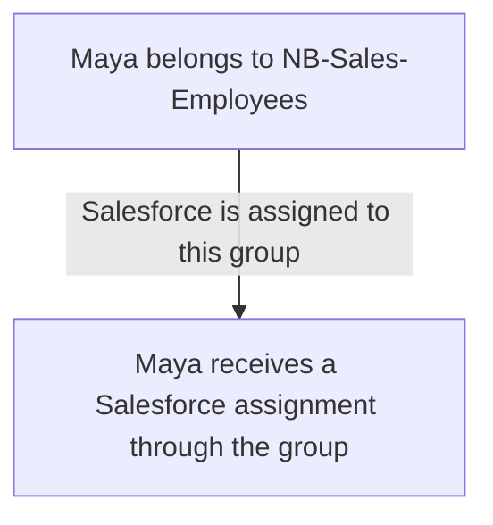
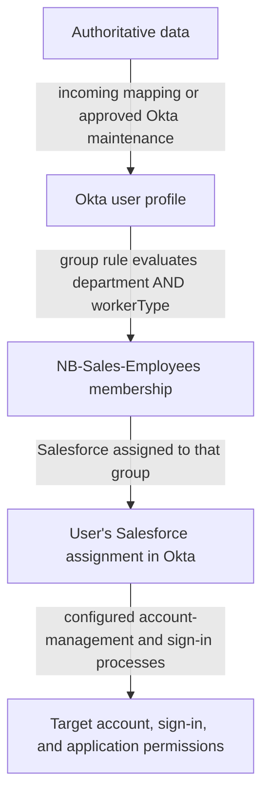

# Day 5: Groups, rules, and application assignments

Maya and Priya both work with Sales. Maya is an employee; Priya is a contractor. Their manager asks:

> They have the same department. Why does Maya receive Salesforce automatically while Priya does not?

Northbridge's requirement is more specific than “give Sales access.” Sales employees receive Salesforce through the normal access process. Sales contractors do not receive it automatically; a separately approved exception may be considered.

Today, follow how that requirement becomes a group membership and an application assignment. Remember Day 4: Maya's employee information comes from Workday, while Priya's profile is maintained in Okta through an approved process.

## Manage a shared need through a group

A **group** is a collection of users managed together. Northbridge could assign Salesforce to each employee separately, but it would then have to track the same business decision across many individual assignments.

Instead, Northbridge uses an Okta-managed group named `NB-Sales-Employees`. Its intended members are employees in Sales. Salesforce is assigned to that group.

There are two distinct relationships:



**Membership** means a user belongs to the group. **Group-based application assignment** means members receive an application assignment through that group's connection to the application.

The name `NB-Sales-Employees` is a label. Naming a group does not define its members or connect it to Salesforce. Both relationships need configuration and evidence.

## A rule decides membership; an assignment connects the application

A **group rule** evaluates a condition and manages membership in its designated group. For this example, the condition reads values from the Okta user profile.

Northbridge defines a custom text attribute, `workerType`, whose approved values here are `Employee` and `Contractor`. It describes the person's workforce classification. It is not their account status or the name of an Okta profile schema type.

Workday supplies that classification for employees. Priya's value is maintained through her sponsor-approved Okta process. Northbridge does not let users choose their own classification to obtain access.

The intended rule is:

```text
If department is Sales
AND workerType is Employee
then include the user in NB-Sales-Employees.
```

This is plain-language logic, not expression code. **AND** requires both conditions to be true. A **Boolean** result is a true-or-false result: does this user meet the condition?

The rule's output is group membership. The separate assignment of Salesforce to the group gives that membership its application-access purpose.



This is a conceptual dependency flow. It is not a guarantee that all steps complete immediately or successfully.

## Predict who matches

All three users below are Active in Okta. The example rule is active, has no individual exclusions for them, and has processed the supplied profiles. There are no other membership mechanisms for this example group.

Before reading the explanation, predict the result for each person:

| Person | Okta department | Okta workerType |
|---|---|---|
| Maya | Sales | Employee |
| Priya | Sales | Contractor |
| Daniel | Finance | Employee |

Maya meets both conditions. Priya meets the department condition but not the worker-type condition. Daniel meets the worker-type condition but not the department condition. Only Maya qualifies through this rule.

Changing AND to OR would produce a different business rule: a person could qualify by being in Sales or by being an employee. That would include Priya and Daniel in this table. It would not implement Northbridge's employee-only Sales requirement.

A missing or unfamiliar `workerType` does not establish Employee status. Investigate its source and mapping instead of treating “not known to be a contractor” as “confirmed employee.”

## Read the current profile, not just the source record

For this attribute-based rule, the input is the Okta user profile. It does not look directly at Workday whenever you read the rule. External values must be represented in the relevant Okta attributes first.

Suppose Workday correctly says Sales, but Maya's Okta profile says Finance. The rule can correctly evaluate the supplied Okta value and still produce an outcome that conflicts with the business requirement.

That is why changing a good rule is not automatically the right response to missing access. Day 3's mapping investigation may be needed before membership can be correct.

Also keep the profile layers distinct. A Salesforce app user profile value or a department displayed inside Salesforce is not the same evidence as the central Okta user attribute this rule evaluates.

## A matching condition is not observed membership

An administrator can save a rule without activating it. A valid condition alone therefore does not establish that the rule has operated. A rule can also have explicitly excluded users.

When a matching user is absent, check:

- The current Okta attributes and account state.
- Whether the rule is active and targets the intended group.
- Whether an exclusion applies.
- Evidence of processing and actual membership.

These checks answer different questions. A rule preview or your own prediction tells you how the supplied condition should evaluate; membership evidence tells you whether the relationship exists.

Here is a separate synthetic incident:

| Observation | Evidence |
|---|---|
| Maya's Okta profile | Sales / Employee; Active account. |
| Rule condition | Sales AND Employee; targets NB-Sales-Employees. |
| Rule state | Inactive; never activated. |
| Existing group membership | Maya absent; no other membership mechanism configured. |
| Group-to-application relationship | Salesforce assigned to NB-Sales-Employees. |

The condition matches, but the rule has not been activated. That is a demonstrated configuration gap in the intended automatic membership path. It does not imply that Maya's HR department is wrong.

Alex can propose activating the approved rule after reviewing its full affected population and exclusions. Verification would check actual membership and the resulting Salesforce assignment, followed separately by the required account and sign-in evidence.

Do not use a manual removal as an assumed neutral test of a rule. Okta documents that manually removing a rule-managed user can add that person to the rule's exclusion list. That exclusion then matters when investigating why the person is absent.

## Follow a successful assignment as far as the evidence goes

Return to the normal scenario. This synthetic follow-up confirms the rule is active and processed the listed profiles:

| Person | NB-Sales-Employees membership | Salesforce assignment |
|---|---|---|
| Maya | Present through the rule | Present through NB-Sales-Employees |
| Priya | Absent | Absent; no other assignment path in this snapshot |
| Daniel | Absent | Absent; no other assignment path in this snapshot |

Maya's automatic assignment is demonstrated. Priya's lack of automatic assignment is expected under the stated requirement, rather than evidence of a malfunction.

The packet does not provide Salesforce account state, a provisioning result, a completed Salesforce sign-in, or application permissions. Those are still separate facts. An assignment may start a configured account-management operation; it is not a receipt showing that the target accepted it.

## An individual assignment is a separate path

A **direct assignment** assigns an application to a person individually. It can represent an approved exception, but its presence alone does not prove approval.

Consider a separate snapshot: Priya remains outside `NB-Sales-Employees`, but her Salesforce assignment is recorded as individual. No approval record is supplied.

There is no contradiction between her rule result and her assignment. The rule explains why she did not join this group; it does not explain every other way an application can be assigned.

Ask for the requirement, approval, responsible owner, and review or removal condition for the individual assignment. Do not change Priya's worker type to Employee just to make her fit the normal rule. Do not declare the exception authorized or unauthorized from missing approval evidence alone.

The phrase **assignment source** in this investigation means where the application assignment came from, such as a group or an individual assignment. It does not mean the profile source from Day 4.

## Removing one path does not settle every path

Imagine a future variation in which Maya's approved department changes to Finance. This is a prediction, not a change to her current Sales story.

Once the new value reaches her Okta profile and the active rule processes it, she no longer meets the Sales condition. In the simple rule-managed group described above, her membership should be removed.

Then investigate application assignment separately. Another assigned group or a separately maintained individual assignment can still provide a path. Even confirmed removal of the final Okta assignment does not, by itself, prove the target account's state or the end of an existing application session.

Use evidence in this order: updated profile, processed rule/membership result, remaining assignment paths, then relevant target outcomes. Day 12 develops the full department-move case.

## Group membership has an owner too

Not every group visible in Okta is managed by an Okta rule. Membership may come from an external directory or from authorized manual administration.

For `NB-Sales-Employees`, Northbridge deliberately uses an Okta-managed group and the stated rule. An AD-sourced group has a different maintenance path. Before proposing a membership change, identify what controls that particular group.

The name alone does not establish the owner. Nor does membership in an Okta group mean a same-named group exists in an application.

**Group Push** is a separate capability for creating or maintaining groups and memberships in supported target applications. Assigning Salesforce to a group answers who receives the application assignment. It does not automatically create that group inside Salesforce. Where Group Push is used, Okta requires separate groups for application assignment and Group Push; this lesson does not assume Northbridge's Salesforce integration has Group Push configured.

## Tell the access story

Explain Maya's flow from Workday-owned attributes to the Okta profile, the two-condition rule, group membership, and Salesforce assignment. Name the point where the packet stops proving the outcome.

Then explain Priya's two cases: no assignment under the normal rule, and an individual assignment needing separate approval evidence. A group rule determines membership; it is not a universal instruction to deny every nonmember access by every other path.

## Before moving on

Can you explain:

- Why a group name does not determine membership or assignments?
- Why Maya matches while Priya and Daniel do not?
- Which profile the example rule reads?
- Why condition, rule state, membership, and assignment are separate checks?
- How an individual assignment changes the investigation?
- Why group removal does not prove all application access has ended?
- How application assignment differs from Group Push?

Try the [Day 5 exercises](../exercises/day-05.md) and then read the [self-check answers](../self-checks/day-05.md). Next, attempt the [foundation checkpoint](../assessments/foundation.md), which combines Days 1–5.

In [your notebook](../notebook/guide.md), extend the ownership flow with the rule condition, membership mechanism, assignment path, and the evidence needed beyond assignment.

[Day 6](day-06-active-directory.md) separates AD imports from AD password validation.

[Previous: Day 4](day-04-sources-and-ownership.md) · [Course home](../README.md)
