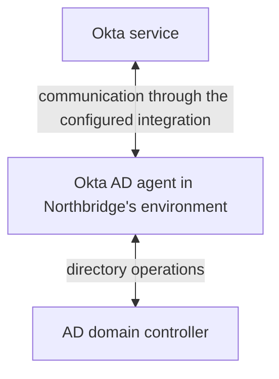
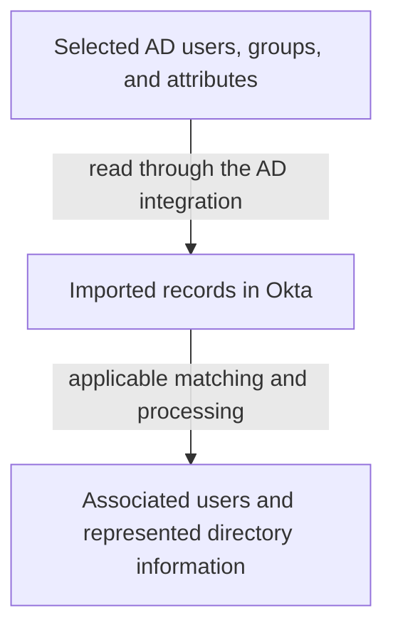
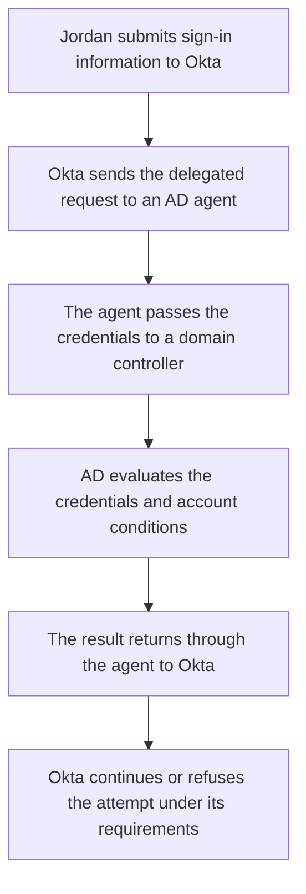
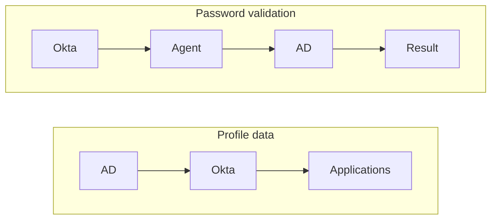

# Day 6: AD imports and password validation

Jordan Lee is an active Northbridge employee. His later departure has not occurred. An AD import completed successfully, and Alex confirmed that Jordan's directory record is associated with the correct Okta user.

Jordan now reports:

> My directory account is in Okta, but I cannot sign in with my AD password.

The import and the sign-in attempted different operations. To investigate, follow each path separately.

Your goal is to explain why reading Jordan's directory record does not prove his password was accepted, and to distinguish no response from an explicit rejection.

## Locate the directory, the server, and the agent

Northbridge uses **Active Directory Domain Services**, often shortened here to AD, for its employee directory. It holds objects such as users, groups, and computers. A user object contains information about a directory account; a group represents a collection used for access or administration.

An AD **domain** is a directory and administration boundary containing these objects. A **domain controller**, or **DC**, is a server running the directory service. It can respond to directory queries and validate domain credentials. **Credentials** are the information used to prove identity; on this password path, they include the submitted account name and password. A domain can have more than one domain controller.

An **organizational unit**, or **OU**, is a container inside a domain that helps organize objects and delegate administration. An OU is not a group: placing a user inside an OU does not make that user a member of a same-named group.

The **Okta AD agent** is separate software in the company's environment. It connects Okta with AD for supported operations. It is neither the AD directory database nor the domain controller itself. It can run on a separate server.

These arrows describe communication relationships, not a requirement to expose a domain controller directly to the internet. The agent's connection to Okta and its ability to perform a particular AD operation are separate things to verify.

## Northbridge is still HR-led

Workday controls Jordan's employee profile. Okta maintains his workforce identity and connects to his AD account. AD supplies specifically designated directory-owned values and validates his password when the AD password path is used.

These responsibilities do not conflict:

| Question | Northbridge's answer |
|---|---|
| Who controls Jordan's employee department? | Workday, through the inherited profile-source decision. |
| Where is his directory account? | AD, linked to his Okta identity. |
| Who validates his password on the configured AD password path? | AD, through the agent. |
| Who makes the remaining Okta sign-in decisions? | Okta, using the applicable requirements and context. |

The sign-in path does not promote AD above Workday as the HR profile source. Recall Day 4: password validation and attribute ownership answer different questions.

Priya's Okta-managed contractor identity has no AD assignment in this architecture. Do not assume that her sign-in uses Jordan's AD path merely because both people use Okta.

## What an import establishes

An **import** brings directory records and changes into Okta for processing. The relevant flow is:

Import scope matters. The integration selects which user and group OUs to include. A successful import of the selected population is not a statement that every object in AD was included.

Imagine the employee user OU is included, but a separate group OU is not. The import might supply Jordan's user record without supplying a group the investigator expected. Check scope before concluding that the group does not exist in AD.

Matching and confirmation matter too. Discovering a record is not the same as establishing the correct identity association. For Jordan's incident, the packet explicitly supplies that association; Day 11 examines how to reason about uncertain matches.

Importing profile information does not demonstrate that Jordan entered a valid password, that AD accepted a password-validation request, or that a later sign-in path remained available.

It also does not turn every imported AD attribute into the controlling value for an HR-led user. Source and mapping settings still apply.

## Follow delegated authentication

When a system asks another system to validate a user's credentials, it is **delegating authentication**. On Northbridge's configured AD password path, Okta asks AD to check Jordan's submitted credentials through the agent.

The following is a simplified logical flow:

A successful password result is one sign-in step. Additional authentication or policy requirements may remain, and application assignment and application-side acceptance are still separate. Not every sign-in method uses this password path.

The incident evidence should identify the affected user, the directory association, the relevant attempt, and the agent/DC path involved. A successful password event for another person does not resolve Jordan's attempt.

## Three operations that should not be confused

| Operation | Main question | What success does not establish |
|---|---|---|
| Directory import | Could the configured operation read and process the selected directory data? | That a user's password was accepted. |
| Delegated password authentication | Did AD accept the credentials for this attempt through the agent? | That every later requirement or application action succeeded. |
| Password synchronization | Did a configured process propagate a password change to a supported destination? | That a later authentication attempt succeeded. |

Password synchronization transfers password changes through a supported, configured process; delegation asks AD to validate credentials during the sign-in path. They are different capabilities even when a deployment uses both for different purposes.

Okta documents a separate **AD Password Sync Agent** for relevant synchronization scenarios. Do not treat its name as another name for the ordinary AD agent. The required components and direction depend on the synchronization use case. Northbridge's incident uses delegated authentication; a successful import is not evidence of password synchronization.

Keep the question concrete: which password operation, in which direction, for which destination? A general statement that “passwords are integrated” leaves those decisions unanswered.

## Investigate Jordan's failed attempt

The following synthetic evidence is a plain-language investigation summary, not literal Okta or Windows log output. The investigator has correlated the authentication observations to the same attempt, labelled J-1. Earlier import I-1 is a separate operation.

| Evidence | Observation |
|---|---|
| Approved employment and Okta state | Jordan is employed; his Okta account is Active. |
| Account association | His expected AD account is linked to the checked Okta user. |
| Earlier import I-1 | Completed; Jordan's selected directory data was processed. |
| Authentication configuration | AD delegated password authentication applies to this attempt. |
| Agent observation for J-1 | The handling agent received the delegated request from Okta. |
| Agent-to-DC observation for J-1 | The connection attempt to the selected DC timed out before a credential-validation response was obtained. |
| Returned AD credential result | No acceptance or rejection result was obtained for J-1. |
| User experience | Jordan could not complete this sign-in attempt. |

Before reading on, locate the first demonstrated failure. Did AD reject Jordan's password?

The demonstrated failure is the unsuccessful agent-to-DC connection attempt. The packet does not show AD rejecting the password. It does not establish that the password was correct either: no credential result was obtained.

A **timeout** means the operation did not obtain the expected result within its allowed wait. Compare “I did not receive an answer” with “I received an answer saying no.” They lead to different investigations even when Jordan sees a sign-in failure in both cases.

The earlier import shows that its own data operation completed. It does not prove the later path was healthy. Likewise, the handling agent received a request from Okta, but that does not prove it could reach the domain controller.

Alex should request the relevant agent and directory/network evidence for J-1: the selected DC, name resolution, reachability, and service availability. **Name resolution**, introduced as DNS on Day 2, is the lookup that connects a host name with a network address. Failure to resolve a name and a connection timeout are different observations; neither should be invented from the other.

A routing problem, a network control, or an unavailable service could help explain the timeout. The packet does not choose among them. Resetting Jordan's password would not explain the demonstrated connectivity failure.

## Contrast a credential rejection

In a separate attempt, J-2, suppose the handling agent reaches the DC and receives an explicit credential-validation rejection.

That evidence moves the investigation. AD responded to the validation request, so the unanswered question concerns the rejected identity or credentials and relevant account conditions. Check the detailed directory result and the actual username/account involved.

Do not translate every rejection into “the user mistyped the password.” A generic rejection may not distinguish an incorrect identifier, a password issue, or an account restriction. Ask for the detail that separates them before choosing a correction.

An AD sign-in name can differ from a work email address. A **user principal name**, or **UPN**, is a directory sign-in name often written in an email-like form. Its appearance does not prove it is the person's mailbox address. Check the configured identifier and associated account rather than assuming identical strings across systems.

## Know what a successful follow-up proves

Here is a synthetic follow-up to J-1, with new evidence:

- The network team identifies and corrects a route preventing the handling agent from reaching the selected DC.
- A new attempt, J-3, is correlated across the relevant records.
- The agent reaches the DC, and AD returns an accepted credential result for Jordan.
- Evidence of the remaining Okta checks and application entry is not supplied.

The new evidence supports recovery of the checked connection and successful password validation in J-3. It does not establish complete application access. The confirmed routing finding belongs to this follow-up; it was only a possible explanation in the original packet.

This is how an investigation progresses: keep the first conclusion within the initial evidence, then update it when additional evidence establishes the cause and recovery.

## Compare the AD-led variation

In a separately labelled AD-led company, AD may control the employee profile as well as validate the password:

That differs from Northbridge's Workday-led profile flow. Import and authentication remain distinct in both architectures. Neither a source-priority decision nor a successful import replaces authentication evidence.

## Before moving on

Can you explain:

- The separate roles of AD, a domain controller, and the Okta AD agent?
- Why an OU is different from a group and why import scope matters?
- How Workday can control a profile while AD validates a password?
- Why import, delegated authentication, and password synchronization differ?
- Why J-1 supports a connectivity investigation rather than a confirmed bad password?
- What changes when the DC returns an explicit rejection?
- What J-3 establishes and which outcomes still need evidence?

Try the [Day 6 exercises](../exercises/day-06.md), then compare with the [separate answers](../self-checks/day-06.md).

In [your notebook](../notebook/guide.md), draw the import and password paths separately. For each, name the operation, observed result, and the next evidence needed. Keep profile ownership beside the diagram rather than using it as a substitute for a sign-in result.

[Day 7](day-07-authenticators-enrollment-mfa.md) explains authenticators, enrollment, and additional authentication requirements.

[Previous: Day 5](day-05-groups-and-assignments.md) · [Course home](../index.md)

[Revise Day 6](../revision/day-06.md): revisit the concepts, example, and questions without rereading the full lesson.
