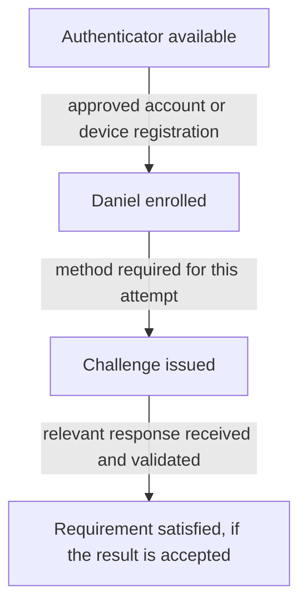

# Day 7: Authenticators, enrollment, and MFA

Daniel opens Northbridge Expense. His password is accepted, but he is asked to set up Okta Verify before continuing. His manager asks:

> We already enabled Okta Verify. Why does Daniel need to set it up?

Enabling a capability for the organization and connecting that capability to Daniel are different actions. Using it successfully for a particular sign-in is another step.

Recall Day 6: an accepted password result does not establish that all sign-in requirements have been met. Now follow the additional proof the company requires.

Your goal is to separate an authenticator being available, Daniel enrolling it, and an accepted result for the current attempt.

## Why a password may not be enough

A password is something Daniel knows. Someone else who obtains it might try to use it. Northbridge can require another kind of evidence, such as proof involving a registered device Daniel possesses.

An **authenticator** is a means of providing authentication evidence. A password, a supported security key, and Okta Verify are examples. Authenticators can support different **methods**, or ways of authenticating. The authenticator's name alone does not describe every method or security property it supports.

A **factor type** describes the kind of evidence:

| Factor type | Plain meaning | Example |
|---|---|---|
| Knowledge | Something you know | A password. |
| Possession | Something you have or control | A registered device used to prove possession. |
| Biometric | Something you are | Fingerprint or face verification supported by a device. |

**Multifactor authentication**, or **MFA**, combines different factor types. It adds evidence beyond a single kind of proof.

Count the kinds of evidence, not the screens. Asking for two passwords is still asking for knowledge twice. Two prompts do not automatically establish two factors. Conversely, a supported authenticator interaction may establish more than one factor, such as device possession together with biometric verification.

MFA and authorization remain different. Stronger authentication does not grant Daniel an Expense approval role or create his application account.

Keep the three terms connected: Okta Verify is the **authenticator**; Push is one **method** it supports; a successfully validated registered-device interaction can supply **possession** evidence. The authenticator names the means, the method names how it is used, and the factor type names the kind of proof. [Okta's Verify reference](https://help.okta.com/oie/en-us/content/topics/identity-engine/authenticators/configure-okta-verify.htm) describes its supported methods.

## Separate availability, enrollment, and use

Imagine Northbridge has made Okta Verify available for its users. Daniel installs the app on his phone. Is that enough to authenticate to Northbridge with it?

The app still needs the relevant registration linking an authenticator to Daniel's Northbridge account. This is **enrollment**. Installing software is not evidence that this account-specific setup is complete.

| Question | Evidence to inspect |
|---|---|
| Is the authenticator available under the applicable configuration? | Authenticator settings and enrollment rules for this user. |
| Has Daniel enrolled it for his Northbridge account? | The relevant enrollment and device/account association. |
| Is the method acceptable for this attempt? | The stated authentication requirement and supported method. |
| Did Daniel complete it successfully? | The authentication result for the identified attempt. |

An enrollment is not a successful sign-in result. A previous successful use is not automatic proof that the current attempt meets its requirements.

Keep device context in view. Enrollment on Daniel's old phone does not establish that a replacement phone is ready. Likewise, an account in Okta Verify for another organization does not establish a Northbridge enrollment.

## Two requirements with different jobs

A **policy** expresses configured requirements for a population or situation. For now, distinguish these two purposes:

- An **authenticator enrollment policy** governs which authenticators users may or must enroll and when enrollment is required.
- An **authentication requirement** describes what proof is needed for an access attempt.

Required enrollment does not mean that every application must ask for that authenticator on every visit. Optional enrollment does not mean that an authenticator can never be needed to satisfy an application's requirement.

For the example below, Northbridge has made the following decisions. These are supplied assumptions, not universal Okta defaults:

| Decision | Daniel's applicable requirement |
|---|---|
| Enrollment | Okta Verify enrollment is required now; no postponement applies. |
| Expense authentication | This fresh attempt needs accepted password evidence and an accepted Okta Verify Push response. |
| Method availability | Push is enabled and supported on Daniel's mobile device. |
| Prior authentication | No earlier verification is being reused to satisfy the Push requirement in this packet. |

These facts let us reason about the example without learning the full policy evaluation sequence. Day 13 examines policy selection and session behavior.

## Follow Daniel's enrollment question

Alex collects this synthetic packet for attempt D-1. It is a plain-language summary, not a raw Okta event:

| Observation | Evidence |
|---|---|
| Daniel's Okta identity | Correct account; Active. |
| Authenticator configuration | Okta Verify is enabled and allowed for Daniel. |
| Applicable enrollment requirement | Enrollment required now. |
| Daniel's Northbridge enrollment | No completed Okta Verify enrollment found for this account. |
| Password result for D-1 | Accepted. |
| What Daniel sees | A request to set up Okta Verify. |

Predict the explanation before reading on: which two facts did the manager combine?

The manager treated organization-level availability as proof of Daniel's enrollment. The packet shows the first but not the second. The setup request is consistent with the supplied requirement and missing enrollment.

Alex should explain the approved enrollment path and verify that Daniel completes the association for the correct Northbridge account and supported device. There is no evidence here that a password reset or a change to Daniel's department would help.

Enrollment itself is security-sensitive: it establishes a means of proving identity. If Daniel cannot complete it, the next question concerns the actual enrollment failure and approved assistance process, rather than removing the requirement just to make the prompt disappear.

## Enrollment does not answer a challenge

Suppose Daniel subsequently completes the approved enrollment. In a new attempt D-2, the same stated Expense requirement applies. His password is accepted, and a Push request is issued to the registered device. No accepted response is yet recorded.

A **challenge** is a request for authentication proof during an interaction. For Push, Daniel responds through the registered device; the system must receive and accept the relevant response.

This is a conceptual relationship, not a claim that every authenticator displays the same sequence of screens.

For D-2, enrollment is established but accepted Push evidence is not. “Issued” is also not proof that Daniel received or approved the notification. Investigate delivery, the selected enrollment/device, and the response outcome before choosing a cause.

An expired challenge, a user denial, and an undelivered notification are different findings. None is established merely by the absence of an accepted response. A broad “MFA failed” description hides those distinctions.

For a successful follow-up, the investigator obtains an accepted response tied to the current attempt and confirms that the stated authentication requirement is satisfied. Application entry and permissions still need their own evidence.

## Okta Verify methods are not interchangeable

Okta Verify supports several authentication experiences, subject to configuration and platform support:

| Method | What the user does conceptually |
|---|---|
| Time-based one-time password, or TOTP | Enters a changing code generated by the app. |
| Push | Responds to a notification on a registered mobile device. |
| FastPass | Uses a device-based cryptographic authentication flow through Okta Verify. |

Knowing Daniel has Okta Verify does not tell us which method an attempt used or whether it meets the stated requirement. A TOTP result is not a Push result. Two methods from the same app also do not automatically prove two different factor types.

In Northbridge's supplied Push example, inspect the Push outcome. Do not substitute an unrelated code result or an older event because it also says Okta Verify.

## Where FastPass fits

**Okta FastPass** provides passwordless authentication through Okta Verify using cryptographic proof associated with an enrolled device. Instead of treating a typed password as the proof in that flow, the system validates a response to its challenge.

FastPass is not another name for approving a Push notification. It can provide phishing-resistant authentication in supported, correctly configured flows. **Phishing resistance** helps prevent authentication proof from being used through an impostor site. It does not mean every flow bearing the Okta Verify name has the same protection or that all forms of account compromise are impossible.

A flow can also require **user verification**, such as a supported device biometric or passcode check. Whether the required proof was provided depends on the method, device, configuration, and actual result. “FastPass enabled” does not prove those conditions were met for an attempt.

Passwordless means the flow does not require a password; it does not mean “no authentication” or “automatically single-factor.” Do not infer factor count from whether a password field appeared.

For Northbridge, an AD password attempt still follows Day 6's delegated path. A separately permitted FastPass flow is not evidence that AD validated a password during that attempt. Do not silently change the authentication path when comparing incidents.

## Keep the evidence tied to the question

| Report | First distinction to investigate |
|---|---|
| “The app is installed, but setup is still requested.” | Installation versus correct account enrollment. |
| “Daniel is enrolled, but access asks for another check.” | Enrollment versus the current authentication requirement. |
| “A notification was sent, so MFA worked.” | Challenge issuance versus accepted response. |
| “Password accepted, so Expense must work.” | One authentication result versus all requirements and target access. |

Do not reset every authenticator because the ticket says MFA. A reset changes enrollment state and may require setup again; it does not explain the original failure. Use the supplied evidence to choose the next investigation. Recovery and administrative responsibilities are developed later.

## Read the enrollment before choosing a reset

The user's authenticator information answers which enrollments are associated with that identity. The organization's authenticator configuration answers which methods are available. Inspect both before interpreting a report that “Verify is installed but does not work.” An installation may belong to another organization or lack the needed enrollment.

For an issued Push with no accepted response, first establish what the user experienced and read the attempt's outcome. A notification failure, an expired request, and an unavailable old phone call for different next checks. Removing an enrollment does not explain which of those happened.

If replacement is necessary, follow the approved identity-verification and recovery process with the required authority. The completion evidence is a replacement enrollment and a permitted subsequent sign-in, not merely a completed reset action. Keep the detailed [replacement-phone situation](../requests/recovery-and-account-state.md) for after Day 14, when recovery responsibilities have been introduced.

## Before moving on

Can you explain:

- The difference between an authenticator, a method, and a factor type?
- Why installing Okta Verify differs from enrolling Daniel's account?
- Why required enrollment differs from proof required for an attempt?
- What a challenge being issued proves and leaves unknown?
- Why two prompts do not automatically mean two factors?
- How Push and FastPass differ at a conceptual level?
- Why satisfied authentication still does not establish application permissions?

Try the [Day 7 exercises](../exercises/day-07.md), then read the [separate answers](../self-checks/day-07.md).

In [your notebook](../notebook/guide.md), record Daniel's availability, enrollment, required method, and attempt result as four separate facts. Explain which fact would change your next action.

[Day 8](day-08-saml.md) follows the identity information an application receives through SAML after the relevant Okta checks.

[Previous: Day 6](day-06-active-directory.md) · [Course home](../index.md)

[Revise Day 7](../revision/day-07.md): revisit the concepts, example, and questions without rereading the full lesson.
