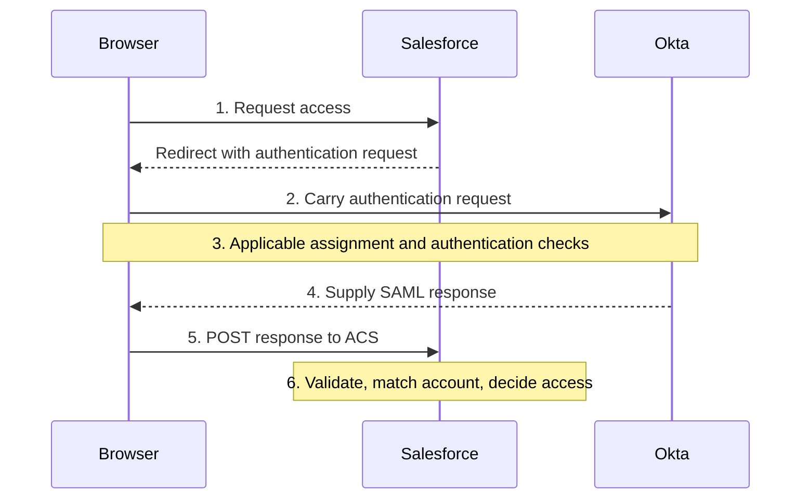

# Day 8: SAML and application sign-in

Maya opens Northbridge's Salesforce environment. She completes the required Okta checks, returns to Salesforce, and sees a sign-in rejection.

Alex finds a successful Okta SSO event for the same attempt. Day 2 explains why that does not settle the application outcome. Now examine the information Salesforce received and the expectations it checked.

For this case, Salesforce is assigned to Maya, and her intended Salesforce account exists and is active. These are supplied facts for this incident; they do not retroactively resolve Day 1's incomplete ticket.

Your goal is to distinguish delivering a SAML response from the application accepting it, then compare the rejected field with the connection's approved value.

## The application needs trustworthy identity information

Salesforce needs to know which user is arriving and whether it can trust the authentication behind that identity. In a federated sign-in, it can rely on information from Okta under a configured trust relationship.

**SAML**, Security Assertion Markup Language, is a standard used for this exchange. In this example:

| Participant | SAML role | Responsibility |
|---|---|---|
| Maya | User | Starts the access attempt and completes required interactions. |
| Okta | Identity provider, or IdP | Performs the applicable identity checks and issues SAML information. |
| Salesforce | Service provider, or SP | Validates the received information, identifies the application user, and controls access. |
| Browser | Message carrier | Carries the browser-based exchange between the two services. |

The IdP and SP names describe roles in this connection. They do not mean that every system always has the same role in every integration.

Okta does not send Maya's AD password to Salesforce in this SAML flow. It sends an assertion about her identity and authentication. If AD validated her password earlier, that remains a separate step from what Salesforce receives.

## Request, response, and assertion

When Salesforce starts the flow, it can issue an **authentication request**, often called an `AuthnRequest`, asking the IdP to authenticate the user under the connection's requirements.

The IdP returns a **SAML response**. A successful response in this flow contains an **assertion**: statements about the user and authentication, with conditions governing their use.

The response is the enclosing protocol message; the assertion is the identity statement inside it. A protocol-level success status does not require Salesforce to accept an assertion that fails its checks.

Think of the assertion as answering questions such as:

- Who issued this information?
- Which user does it describe?
- Which application is it intended for?
- Under what conditions may it be accepted?

These are claims to validate, not facts to accept merely because they appear in readable text.

## Follow the browser

Northbridge's example starts at Salesforce, so it is **SP-initiated**:



The application's **Assertion Consumer Service**, or **ACS**, receives the response at a configured **endpoint**: an address for a particular operation. In a common browser flow, the browser submits the response there using an HTTP POST. Recall Day 2: POST describes a message operation, not automatic account creation.

This diagram is a simplified browser exchange, not a complete network trace. An existing authentication context may affect which prompts occur; do not assume every SAML launch repeats every factor.

An **IdP-initiated** flow starts from the identity provider, such as launching an application from Okta. It does not begin with the same SP authentication request. Support and validation behavior depend on the integration. Changing where the flow starts does not remove the SP's obligation to validate the response.

## The two sides need agreed configuration

Each side needs information about its partner. **SAML metadata** describes connection information such as identifiers, endpoints, and signing certificates. An integration may exchange a metadata document or configure the relevant values separately.

An **entity ID** identifies a SAML participant. Even when it looks like a web address, it serves as an identifier; it is not automatically the endpoint receiving the browser's message.

The ACS URL is a destination. The SP entity ID identifies the intended application. Confusing them can produce a message delivered to the right endpoint but addressed to the wrong audience.

**Audience** answers “which service may use this assertion?” **NameID** identifies the user described by it, under the connection's chosen matching rule. These answer different questions from the ACS URL's “where is the response delivered?”

Northbridge uses these fictional teaching values for its production Salesforce connection. They are not real Salesforce endpoint formats to copy:

| Meaning | Expected value |
|---|---|
| Trusted IdP issuer | `https://identity.northbridge.example/saml/idp` |
| SP entity ID / expected audience | `https://salesforce.northbridge.example/entity/prod` |
| ACS destination | `https://salesforce.northbridge.example/saml/acs` |
| User identification choice | NameID must match the intended Salesforce username. |
| Maya's approved Salesforce username | `maya.rao@northbridge.example` |

Other deployments may use a configured Federation ID instead of username matching. Here, **Federation ID** means a separate user identifier the application can use to match a federated sign-in. Inspect the selected identity rule; an email-looking value is not automatically the right application identifier.

## Read a small piece of XML

SAML uses **XML**, a text format with named elements. An opening tag such as `<saml:NameID>` begins an element; `</saml:NameID>` ends it. Text between them is its value. Elements can contain other elements.

A prefix such as `saml:` identifies a namespace: the vocabulary those element names belong to. In the excerpt below, `xmlns:saml` declares that vocabulary. You do not need to memorize the namespace address.

This is a synthetic, shortened assertion excerpt for Maya's rejected attempt S-1. It preserves only the fields being compared. It omits required surrounding content, signature material, authentication statements, and validity fields. It is not a complete or usable SAML assertion.

```xml
<saml:Assertion xmlns:saml="urn:oasis:names:tc:SAML:2.0:assertion">
  <saml:Issuer>https://identity.northbridge.example/saml/idp</saml:Issuer>
  <saml:Subject>
    <saml:NameID>maya.rao@northbridge.example</saml:NameID>
  </saml:Subject>
  <saml:Conditions>
    <saml:AudienceRestriction>
      <saml:Audience>https://salesforce.northbridge.example/entity/test</saml:Audience>
    </saml:AudienceRestriction>
  </saml:Conditions>
</saml:Assertion>
```

Read it as a sentence: the named issuer describes Maya's username, and this selected audience value identifies the test application configuration. Compare it with the expected production audience before deciding what is wrong.

## What the application must validate

Readable fields are only part of validation:

| Check | Why it matters |
|---|---|
| Issuer | The message must come from the expected identity provider. |
| Signature and trusted signing key | The SP must verify the required signed content using the configured trust information. |
| Audience | The assertion must be intended for this SP under the agreed configuration. |
| Recipient / destination | Delivery-related values must agree with the intended receiving endpoint as required by the flow. |
| Validity conditions | The assertion must be usable at the checked point; fields such as NotBefore and NotOnOrAfter constrain validity. |
| Request correlation and replay checks | Where required, the response must belong to the expected request and must not be reused improperly. |
| User identification | The validated identity must map to the intended account under the application's chosen rule. |

A **digital signature** lets the recipient verify the signed data against trusted signing information. It is not encryption: a signed message can still be readable. A **signing certificate** supplies public-key information used in that trust configuration. Merely seeing a signature element or certificate is not proof that validation succeeded.

Likewise, displaying or decoding an assertion is not validating it. The shortened excerpt cannot establish signature or time checks. Those require the full relevant message and validation evidence. Clock differences can matter when investigating a validity rejection, but an expiry label alone does not prove which clock or setting is wrong.

This table groups the checks by purpose. It does not prescribe a universal order in which every application performs them.

## Establish the audience defect

Alex obtains the following synthetic evidence for S-1. The expected values belong to the checked production instance, and the full response observations are correlated to that same attempt.

| Evidence | Finding |
|---|---|
| Okta SSO event | SUCCESS for Maya and the relevant application attempt. |
| Expected audience | The production entity ID shown above. |
| Audience in the full assertion | The test entity ID shown in the excerpt. |
| Application validation report | Rejects the assertion because the audience differs from its configured entity ID. |
| Issuer, required signature, and validity checks | Reported as accepted in the supplied validation evidence. |
| Intended account record | Active; approved username matches the excerpt's NameID. |

The packet establishes an audience mismatch and an application rejection on that basis. The signature and time conclusions come from the supplied report, not from the shortened XML.

Alex should compare the approved connection settings on both sides and correct the value responsible for sending the test audience to the production connection. Review the affected integration before changing it. Do not disable audience validation or change Maya's correct username to compensate for a different field's defect.

A verified correction needs a new attempt: the emitted audience matches the intended production value, application validation accepts the response, and Maya reaches the correct application account. The original SUCCESS event is not verification of the new attempt.

## A different NameID calls for a different investigation

In a separate variation S-2, the audience and required validation checks pass. The assertion instead carries `maya.old@northbridge.example`; the approved target username is still `maya.rao@northbridge.example`. The application reports that it cannot find a user under its configured username-matching rule.

This is an identity-matching discrepancy. Follow the application username/NameID mapping and the linked target record. Do not change the audience again or create another account merely because the application cannot match the presented value.

The comparison also depends on the matching rule. If a connection expects Federation ID, comparing only the target's username would not establish the correct match. Configuration supplies the meaning of the value.

## Authentication does not define the account lifecycle

SAML sign-in and account management remain separate concerns. The main example assumes an existing active Salesforce account and no account creation during this sign-in.

Some applications can separately support **just-in-time provisioning**, or **JIT**, which creates or updates an account during a configured sign-in journey. That capability must be supported and configured; it is not guaranteed by receiving a SAML assertion. Day 11 returns to account creation and matching choices.

After a response is accepted, the application establishes its own sign-in/session outcome and applies its permissions. SAML acceptance does not automatically give Maya every Salesforce action. If she enters the correct account but an action is denied, investigate the relevant application authorization requirement, as with Daniel on Day 1.

## Compare the two sides of the connection

The application integration's Sign On settings describe the Okta side of the SAML connection. Compare them with the intended application's configuration and the actual message. Check the production or test instance before comparing the issuer, audience, ACS, and user identifier. A saved setting is not proof that a captured response contains that value.

A signing-certificate change needs coordination too. The certificate identifies a public key the application can use to verify signatures; it is not the user's password. Generating a new certificate does not by itself establish that the application trusts it. Inspect the active signing choice, the application's trusted certificate, and the supported transition process before activation. See [signing-certificate settings](https://help.okta.com/oie/en-us/Content/Topics/Apps/manage-signing-certificates.htm).

After a change, verify a fresh response and target acceptance. Do not use an old application session as proof that the new signing relationship works. The [connection-maintenance situation](../requests/connection-maintenance.md) develops this comparison after Day 14.

## Before moving on

Can you explain:

- Which participant is the IdP, which is the SP, and what the browser carries?
- How request, response, and assertion differ?
- Why ACS destination and audience are different concepts?
- How NameID matching depends on the selected application identity rule?
- Why readable XML and a signature element do not prove validation?
- What establishes the cause in S-1 and what changes in S-2?
- Why successful federation is not proof of account provisioning or every application permission?

Try the [Day 8 exercises](../exercises/day-08.md), then read the [separate answers](../self-checks/day-08.md).

In [your notebook](../notebook/guide.md), draw the browser flow and annotate the issuer, intended audience, receiving endpoint, and user identifier. Keep expected configuration beside observed message values.

[Day 9](day-09-oidc.md) follows Northbridge Expense through OIDC, a different sign-in protocol.

[Previous: Day 7](day-07-authenticators-enrollment-mfa.md) · [Course home](../index.md)

[Revise Day 8](../revision/day-08.md): revisit the concepts, example, and questions without rereading the full lesson.
