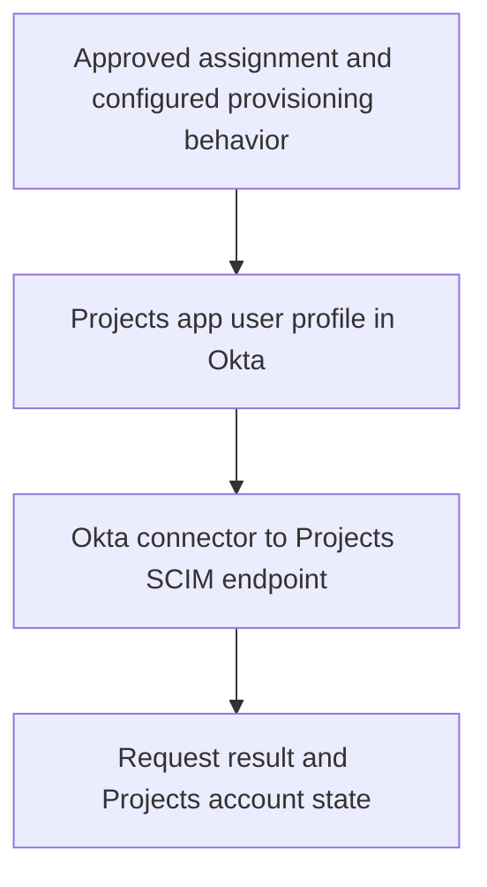

# Day 10: SCIM and application accounts

Maya has an approved Northbridge Projects assignment in Okta. The support ticket says, “Assigned, but no usable Projects account.” Alex needs more than the assignment screen to explain the result.

An assignment establishes a relationship in Okta. A separate account-management operation must reach Projects and be accepted. The target may reject it, or an account may already exist and need careful identification.

## Follow the account-management path

**SCIM**, System for Cross-domain Identity Management, standardizes exchanges for managing identity resources. Here Okta is the SCIM client sending requests, and Projects is the service provider receiving them. A **resource** is an object managed through the interface, such as a user account.



This is a backend exchange, not Maya's browser sign-in. The connector needs its own configured authorization to call Projects. Maya successfully completing MFA does not prove that this connection works. Nor is an Expense ID token a credential for this connection.

The destination is Projects' SCIM interface. It is not an Okta management API endpoint. Naming both the caller and receiving system helps you interpret an HTTP response correctly.

## State the application's contract

An **integration contract** describes supported operations, expected fields, and behavior. These are the assumptions for the fictional Projects connection:

| Item | Projects contract in these examples |
|---|---|
| Protocol and destination | SCIM 2.0 at `https://projects.northbridge.example/scim/v2`. |
| Supported operations | Find, create, update, and deactivate users. Create, profile updates, and deactivation are enabled for the relevant operations. |
| User name | `userName` must be unique within this Projects instance. |
| Department | Required code: SAL, FIN, or IT, retaining Day 3's departmentCode rule. |
| Wire representation | The app profile's departmentCode is sent as department in SCIM's enterprise User extension. |
| Target identifier | Projects assigns an `id`; later operations address the linked resource using that identifier. |
| Deactivation | `active: false` disables the account for new access under Projects' rules and retains the account record. Existing sessions require a separate check. |

The department codes are Projects requirements, not universal SCIM rules. The enterprise extension is a standard place for organizational attributes; this application's accepted values are its own contract. A long schema identifier names the data definition. It is not an address to visit.

Create and ordinary profile updates use POST and PUT in this example. The chosen connector uses PATCH for deactivation. Actual Okta integrations differ: custom integrations created through the App Integration Wizard use PUT for user updates, including deactivation. Read the relevant connector contract rather than assuming every update is PATCH. See [Okta's SCIM operations reference](https://developer.okta.com/docs/api/openapi/okta-scim/guides/scim-20).

## Read a create operation

Start with a successful teaching example C-1. It is separate from the later failure packets. Maya is still a Sales employee. Her approved assignment and Projects app profile are present; the preceding username lookup found no matching account.

The request goes to `/scim/v2/Users` using POST. Its content type is `application/scim+json`. Below is the complete illustrative resource body for this small contract; transport and authorization headers are omitted. This is synthetic evidence to read, not a command to execute.

```json
{
  "schemas": [
    "urn:ietf:params:scim:schemas:core:2.0:User",
    "urn:ietf:params:scim:schemas:extension:enterprise:2.0:User"
  ],
  "userName": "maya.rao@northbridge.example",
  "active": true,
  "urn:ietf:params:scim:schemas:extension:enterprise:2.0:User": {
    "department": "SAL"
  }
}
```

Read the familiar information inside the structure: Maya's user name, the requested active state, and Sales represented as SAL. No `id` is supplied because Projects assigns it.

Projects returns HTTP **201 Created**, content type `application/scim+json`, and a Location header pointing to `https://projects.northbridge.example/scim/v2/Users/prj-1042`. Its response body is:

```json
{
  "schemas": [
    "urn:ietf:params:scim:schemas:core:2.0:User",
    "urn:ietf:params:scim:schemas:extension:enterprise:2.0:User"
  ],
  "id": "prj-1042",
  "userName": "maya.rao@northbridge.example",
  "active": true,
  "urn:ietf:params:scim:schemas:extension:enterprise:2.0:User": {
    "department": "SAL"
  }
}
```

The target reports creation of prj-1042. A subsequent read of that same resource confirms Maya's user name, SAL, and active state. Together these support creation and the checked target state. They do not demonstrate an actual sign-in or project permissions.

SCIM's `id` is the provider's resource identifier. It is not interchangeable with a person's email, Okta object ID, or employee number. A connector association connects the appropriate records; similar-looking identifiers do not create that relationship by themselves. See [SCIM's core schema](https://www.rfc-editor.org/rfc/rfc7643.html).

## A conflict requires an ownership decision

Now use independent packet C-2. Do not carry C-1's created account into this packet.

Maya is assigned, and a create request with her expected user name reaches Projects. The earlier lookup returned no match. Projects' subsequent create response is HTTP **409 Conflict** with this synthetic body:

```json
{
  "schemas": ["urn:ietf:params:scim:api:messages:2.0:Error"],
  "status": "409",
  "scimType": "uniqueness",
  "detail": "userName is already in use in this Projects instance."
}
```

The response establishes a reported uniqueness conflict, not who owns the conflicting record. It also does not establish why the earlier lookup and later create result differ. Another process creating the account between requests is one hypothesis; a lookup problem is another.

Alex requests the existing record's identifier, ownership evidence, the exact lookup and response, and the correlated operation sequence. He should not delete the existing record, invent a different username, or link it to Maya solely to clear the error.

If the account belongs to Maya, approved existing-account handling may be appropriate. If it belongs to someone else, the naming or identity data needs a different correction. Day 11 examines matching. Here the key is that the error locates a boundary without deciding the business resolution.

## A rejected value points to a different correction

Independent packet C-3 concerns Daniel, whose approved department remains Finance. Unlike Day 3's fixed-SAL defect, this packet supplies a different current mapping:

| Evidence | Observation |
|---|---|
| Workday and Okta department | Finance. |
| Outbound mapping and preview | Pass the full department name unchanged. |
| Projects app profile departmentCode | Finance. |
| Sent enterprise department | Finance. |
| Projects response | HTTP 400, with the body below. |

```json
{
  "schemas": ["urn:ietf:params:scim:api:messages:2.0:Error"],
  "status": "400",
  "scimType": "invalidValue",
  "detail": "department must be one of SAL, FIN, IT."
}
```

The current mapping does not meet the stated contract. Correct the approved conversion from Finance to FIN, check the resulting app profile and sent value, and verify the new response and target record. Changing correct HR data to Sales would hide the problem by changing the business fact.

**400** alone means the request was rejected as a bad request; it does not always mean a department problem. Here the body, sent value, and contract establish the specific defect. Likewise, **409** alone is insufficient to decide whose account exists. SCIM error responses provide structured detail; see [the SCIM protocol specification](https://www.rfc-editor.org/rfc/rfc7644.html).

## Updating is not creating again

A profile update addresses the linked existing resource, such as `/Users/prj-1020` for Daniel in a separate successful correction example. PUT replaces the resource's writable representation according to the contract; PATCH describes selected changes. A one-field body must not be treated casually as a complete PUT replacement.

In that correction example, the connector sends a complete supported PUT representation containing FIN for Daniel's enterprise department. Projects returns success, and a subsequent read of prj-1020 confirms FIN. This is an update to a known account, not evidence of a newly created user.

If the app profile contains FIN but no request is supplied, investigate whether the update was eligible, generated, and sent. If the request contains FIN but the response rejects it, investigate the stated rejection. If a response reports success but a later target read differs, check the resource, sequence, and other writers. Each situation calls for different evidence.

## Deactivation is an account-state change

Use a hypothetical approved removal of Maya's Projects access, independent of her actual course timeline. Her linked resource is prj-1042, all assignment paths requiring Projects have been reviewed, and the connector has generated this PATCH to `/scim/v2/Users/prj-1042`:

```json
{
  "schemas": ["urn:ietf:params:scim:api:messages:2.0:PatchOp"],
  "Operations": [
    {
      "op": "replace",
      "path": "active",
      "value": false
    }
  ]
}
```

Projects returns HTTP **204 No Content**: success without a response body. A subsequent read confirms `active: false` and that the account record still exists. Under the stated Projects contract, the account is disabled for new access. This is not deletion of its history or proof that every existing session has ended.

SCIM defines deletion, but Okta's documented outbound SCIM user deprovisioning sets active to false rather than issuing DELETE. Supported and enabled behavior matters. Do not assume that removing a group membership always generated this operation: another assignment path may remain.

## Tell the investigation story

For each ticket, connect the approved requirement, assignment, prepared value, transmitted operation, response, and checked target record. Name what is missing instead of treating the last visible green status as the whole outcome.

Before moving on, explain:

- Why assignment is different from a successful create?
- Which system returns the SCIM response?
- Why userName and target id have different roles?
- Why C-2 needs ownership evidence while C-3 demonstrates a mapping defect?
- How create, update, deactivate, and delete differ?
- Why an empty 204 response can be successful?
- What a target-account check still cannot prove about sign-in and permissions?

Try the [exercises](../exercises/day-10.md), then the [answers](../self-checks/day-10.md). Complete the [integration checkpoint](../assessments/integration.md) before reading its separate debrief. In [your notebook](../notebook/guide.md), record the first demonstrated failure and the evidence needed to verify a correction.

[Day 11](day-11-imports-and-matching.md) follows discovered accounts into matching and association decisions.

[Previous: Day 9](day-09-oidc.md) · [Course home](../index.md)
