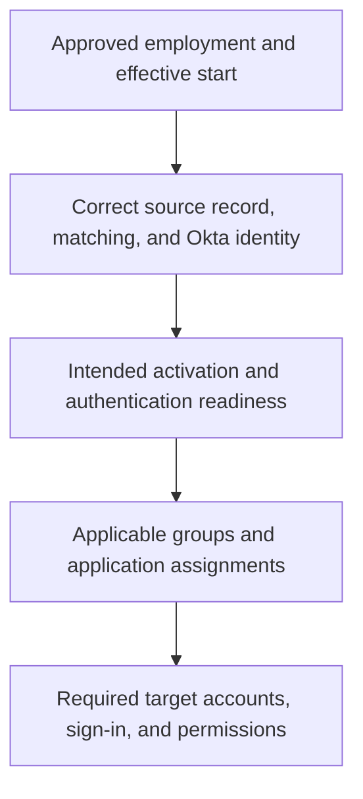

# Day 12: Joining, moving, and leaving

Maya's move to Finance has taken effect. Jordan's employment has ended. Alex receives two tickets: “Maya still has Sales access” and “Jordan's application session still works.”

Both concern a change in someone's relationship with Northbridge. Neither can be resolved by checking only one profile field or one green event.

By the end, trace an approved employment change across the affected systems and distinguish completed outcomes from access that still needs attention.

**Joiner, mover, and leaver**, often shortened to **JML**, describes the identity and access changes associated with starting work, changing responsibilities, and leaving. The business event defines the intended outcome; configured systems must carry it through to the relevant accounts and access paths.

## Name the state and its system

“Active” is incomplete without an object. Jordan's employment record, Okta account, Projects account, and browser session describe different things.

| Observation | Meaning |
|---|---|
| HR employment has ended | A business fact with an effective point and approved lifecycle consequence. |
| Okta user is Active | An Okta account state; not proof of ongoing employment or working application access. |
| Projects user has active true | A target account's administrative state under the Projects contract. |
| An application accepts a session | An observed access result in that application. |

A department or employment field is profile data. It does not become an account-lifecycle action merely because its value changes. Northbridge's configured Workday-driven lifecycle processing must interpret the relevant event, act on the correct identity, and produce verifiable results.

The **effective point** is when the approved business change takes effect. An event's arrival and the completion of downstream changes are separate observations. A future start recorded today does not by itself authorize access today; a departure event arriving on time does not prove every target finished removing access.

## Recognize the relevant Okta account states

The API and Admin Console sometimes use different labels. These are the main distinctions for this lesson, summarized from [Okta's account-status reference](https://help.okta.com/oie/en-us/content/topics/users-groups-profiles/usgp-end-user-states.htm):

| API status | Console label | How to read it |
|---|---|---|
| STAGED | Staged | Created before activation is initiated, or awaiting administrative action. |
| PROVISIONED | Pending user action | Activation-related user action remains. This does not mean every application account was provisioned. |
| ACTIVE | Active | Account is enabled; authentication requirements and application access still need their own checks. |
| RECOVERY | Password reset | Account is in a password-recovery state. |
| PASSWORD_EXPIRED | Password expired | Password update is required. |
| LOCKED_OUT | Locked out | A lockout condition has been reached. |
| SUSPENDED | Suspended | Okta access is suspended while assignments are retained. |
| DEPROVISIONED | Deactivated | Okta account has been deactivated; distinct from deletion. |

These are not mandatory stations in one journey. Account creation, authentication arrangements, and configured lifecycle behavior affect which states occur. A lockout is not an HR termination, and Pending user action is not evidence of a Projects create.

**Suspension** blocks Okta access while retaining app assignments and group memberships. Unsuspension is a different decision from reconstructing removed access. See [suspension behavior](https://help.okta.com/oie/en-us/content/topics/users-groups-profiles/usgp-suspend.htm).

**Deactivation** removes Okta app assignments and invokes applicable configured deprovisioning. Group memberships are retained. **Deletion** removes the Okta user and cannot be undone; it is a separate action after deactivation. It is not a troubleshooting shortcut. Deactivation can run in the background, so a requested action is not itself evidence of completion. See [deactivation and deletion](https://help.okta.com/oie/en-us/content/topics/users-groups-profiles/usgp-deactivate-user-account.htm).

Target behavior requires its own verification. For example, Okta's [outbound SCIM reference](https://developer.okta.com/docs/api/openapi/okta-scim/guides/scim-20) distinguishes suspension from deactivation: suspension alone does not send the SCIM deprovisioning event. Day 10's Projects deactivation sets active false; it does not delete the resource.

## Joiner: connect the initial decisions

Think back to Maya's initial arrival in Sales. A sound joiner explanation connects:

This is a chain of dependencies, not a guarantee that every connector operates in this exact order. Northbridge must distinguish preparation before a start from permission to use access after it takes effect. A future-dated HR record alone is not evidence that access should already work.

If an existing account is found, use Day 11's ownership and matching checks rather than making a second identity. For Priya, use the sponsor-approved Okta-managed process and its agreed access end condition; do not invent a Workday or AD association to fit the employee model.

## Mover: state what should change and what should remain

Maya's approved move now takes effect in the course story. She remains employed and her identity remains NB-1042. Earlier Sales examples describe the earlier state.

Northbridge's approved outcome for packet M-12 is:

- Department becomes Finance in the governed employee profile.
- Normal Sales-group membership and Salesforce access end; no transition exception remains approved.
- Projects access continues, with its department code changed from SAL to FIN.
- Maya retains her existing identity and intended existing Projects account.

Moving is not simply adding new access. It also requires reviewing access that no longer fits the new role. Finance department alone does not make Maya a Finance manager or grant Daniel's approval permissions.

## Follow Maya's evidence

All observations below are synthetic, correlated to Maya's move, and listed in their observed order. They are investigation summaries, not literal product event names.

| Order | Evidence |
|---|---|
| M1 | Workday's approved effective department is Finance; NB-1042 is unchanged. |
| M2 | The correct Workday association is confirmed. Okta department is Finance and workerType is Employee. Okta remains Active. |
| M3 | The active Sales AND Employee rule processes the updated profile. Its rule-managed NB-Sales-Employees membership is removed. |
| M4 | Salesforce remains individually assigned. Review confirms this is the surviving assignment source; no group assignment remains. Its exception approval ended with the move. |
| M5 | The Projects app profile contains FIN. The supported update succeeds for Maya's linked prj-1042 account, and a later target read confirms FIN and active true. |
| M6 | Salesforce confirms a new application session for Maya after the move. |

M1 to M3 show that the source, profile, and Sales rule processed the intended change. M4 establishes the remaining assignment path and its expired business justification. M6 establishes actual retained Salesforce access, not merely a visible tile.

Do not change correct Finance data back to Sales or weaken the rule. Address the remaining individual assignment under the approved removal requirement, then verify the resulting Okta assignment, the applicable Salesforce account-management action, target access, and relevant sessions. Salesforce's connector behavior must be checked; do not substitute the Projects SCIM contract for it.

M5 confirms the department update and an active Projects account. It supplies no Projects sign-in or permission result, so actual entry remains unverified. Deactivating all of Maya's accounts would violate the requirement to keep her working in Projects. A department update also does not prove that any specific project permission was added or removed.

No corrective Salesforce follow-up is supplied here. The ticket remains unresolved at M6, with a demonstrated cause and a supported next action.

## Leaver: verify each outcome

Jordan's departure occurs after the active-employee examples in earlier lessons. Workday remains the source of the approved employment event. Northbridge requires his workforce access to end when departure takes effect, with retained records handled through the appropriate business process.

The following packet concerns his verified identities and linked accounts. Projects deactivation is supported and enabled. Expense is an OIDC application; its account-removal method is not supplied.

| Order | Evidence |
|---|---|
| L1 | Jordan's approved departure is effective in Workday. The configured lifecycle process receives the event for the correctly associated Okta identity. |
| L2 | Okta deactivation completes. A later read shows DEPROVISIONED, and Okta app assignments are absent. |
| L3 | His linked AD account is confirmed disabled by a directory read. |
| L4 | The connector sends active false to Jordan's linked Projects resource. The recorded response is HTTP 503 Service Unavailable. A later target read still shows active true. |
| L5 | A controlled check confirms a fresh Okta sign-in is blocked. |
| L6 | An application-side check of Jordan's pre-existing Expense session retrieves protected expense data after L2. It is a new authenticated response, not just an old page left visible. |

L2 and L5 establish the supplied Okta outcome. L3 independently establishes the checked AD account state. Neither completes the Projects or Expense investigation.

For Projects, the request did not produce the required target state in the supplied evidence. The 503 reports service unavailability; it does not identify the underlying outage cause. Investigate the connector and target result, coordinate an approved way to end access, and verify the account after the correction or supported retry. Do not reactivate Jordan in Okta to make a downstream retry easier.

For Expense, L6 demonstrates continuing authenticated access through that checked session. Flag it for the application owner: confirm the session and account involved, the required termination behavior, the supported action, and the result of a fresh protected request afterward. The packet does not establish why the session persists. Day 13 explains the separate session mechanisms.

Projects and Expense are separate outstanding issues. A later successful Projects deactivation would not resolve the Expense observation. Likewise, blocked fresh Okta sign-in does not erase evidence of the working Expense session.

## Decide what evidence closes the ticket

A useful leaver handoff names the affected systems and remaining exposure. For Jordan:

> Okta deactivation and the checked AD disablement are confirmed. Projects still reports an active account after its failed deactivation request. Expense still accepts the checked existing session. The application owners need to resolve and verify those outcomes. We cannot yet report all required access removed.

Closure requires the agreed application's account and access evidence, not just another successful Okta action. If other applications, credentials, or access paths are part of the departure requirement, include them in the inventory; this three-system packet is not proof about systems it never inspected.

Deleting the Okta record would not demonstrate that a failed target operation or working application session was resolved. It would also be a separate, irreversible decision. Preserve the ability to identify the correct records while completing the access-removal requirement.

For a later return to work, re-evaluate current employment, matching, assignments, and activation requirements. Do not assume reactivation should restore every old exception or that retained group membership represents a new approval.

## Before moving on

Can you distinguish employment data, Okta status, target status, and session observations? Explain why Maya's correct group removal did not end her individual assignment, why Jordan's completed Okta deactivation did not close every target ticket, and what evidence would establish the required corrections.

You do not need to explain Expense's session mechanism yet. Recognizing its observed retained access and requesting a separate check is the correct conclusion here.

Try the [exercises](../exercises/day-12.md), then the [answers](../self-checks/day-12.md). In [your notebook](../notebook/guide.md), make a row for each affected system: approved outcome, observed state, operation result, remaining access, responsible owner, and closure evidence.

[Day 13](day-13-policies-and-sessions.md) examines authentication policies and separate Okta and application sessions.

[Previous: Day 11](day-11-imports-and-matching.md) · [Course home](../index.md)

[Revise Day 12](../revision/day-12.md): revisit the concepts, example, and questions without rereading the full lesson.
