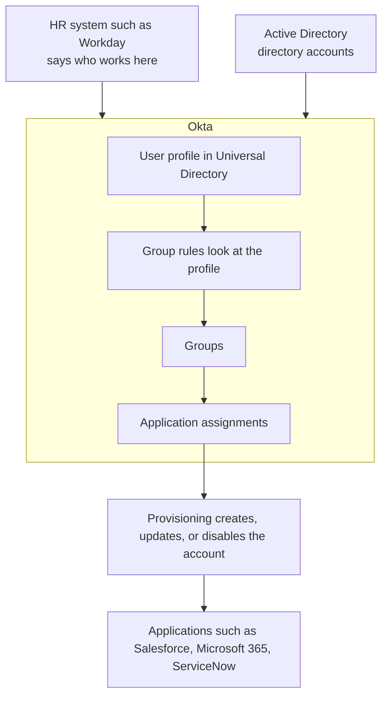
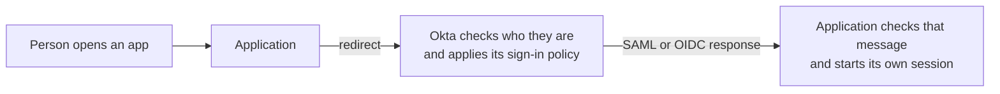

# Okta at a glance

Before you start the daily lessons, here is the whole thing on one page. You do not need to remember it yet. Come back here whenever you lose sight of the bigger picture.

Okta sits in the middle. On one side are the systems that say who works at the company. On the other side are the applications people need to use. Okta keeps a clear picture of each person, connects that picture to the right access, and handles sign-in.

## How identity data flows

Read it as a sentence. The HR system says who works here. Okta keeps a profile for each person. Group rules look at that profile and decide which groups the person belongs to. Groups lead to application assignments. Provisioning then creates or updates the account inside the target application.

Here is the habit to build early. Each arrow is a separate step that can succeed or fail on its own. A person can have an Okta profile and still have no account in Salesforce. Always ask which step you are actually looking at.

## How sign-in works

When someone opens an app, the app sends them to Okta. Okta checks who they are and applies its sign-in rules. It then sends the app a message the app can trust, either a SAML response or an OIDC token. The app checks that message and starts its own session.

Signing in and having an account are two different things. Signing in and being allowed to do a particular action inside the app are also two different things.

## The pieces, one line each

| Piece | What it does |
|---|---|
| Universal Directory | Where Okta stores each person's profile and attributes. |
| Profile | The set of details Okta holds about one person. |
| Profile source | The system allowed to control a person's profile. |
| Group | A collection of users. |
| Group rule | A rule that puts people in a group based on their attributes. |
| Application assignment | A record that a user should get an application. |
| Provisioning | Creating, updating, or disabling the account inside the target app. |
| Authentication | Checking who is signing in. |
| Authorization | Deciding what the signed-in user is allowed to do. |
| Policy | The rules that decide what a sign-in requires. |
| System Log | Okta's record of what happened, which you read as evidence. |

## The one habit to carry everywhere

When something does not work, do not guess. Ask four questions:

1. What should have happened for this person and this app?
2. What actually happened?
3. Where did those two first differ?
4. What evidence proves it?

Every lesson practices this. If you keep one thing from the whole course, keep this.

Ready? Start with [Day 1](lessons/day-01-people-identities-access.md) and follow the [learning path](learning-path.md) in order. When a flow gets confusing, come back to this page.
