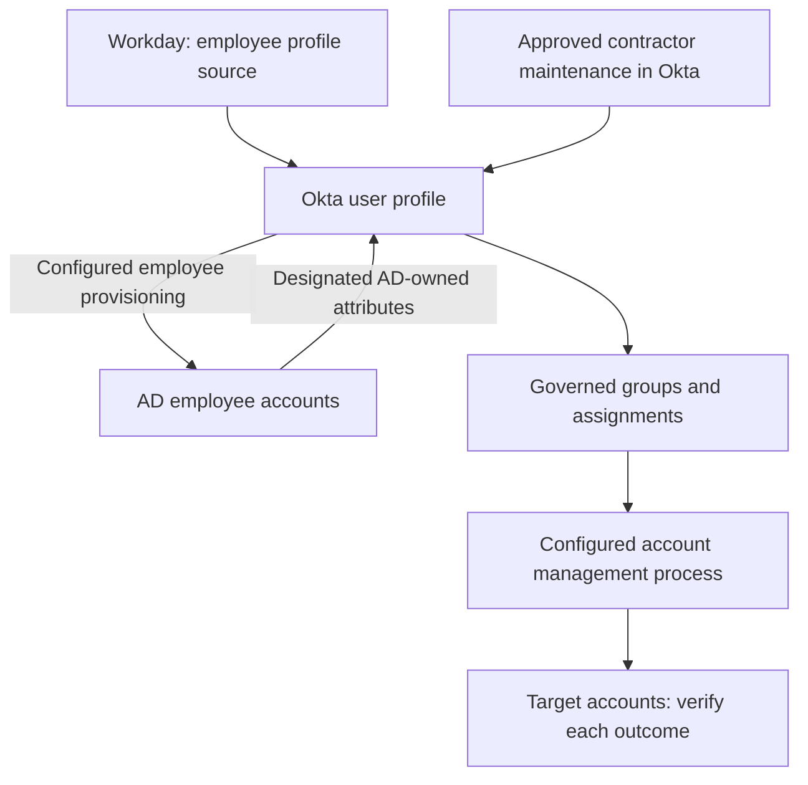
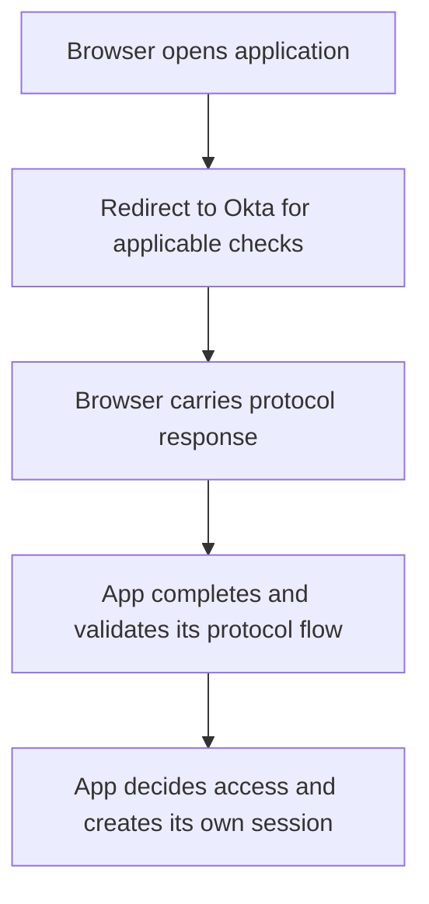

# Okta at a glance

Before you start the daily lessons, here is the whole thing on one page. You do not need to remember it yet. Come back here whenever you lose sight of the bigger picture.

Okta sits in the middle. On one side are the systems that say who works at the company. On the other side are the applications people need to use. Okta keeps a clear picture of each person, connects that picture to the right access, and handles sign-in.

## How identity data flows

At Northbridge, Workday is the profile source for employees such as Maya and Daniel. Okta provisions their AD accounts through the configured employee process; AD returns designated directory-owned values such as work email. Priya is an Okta-managed contractor, maintained after sponsor approval and outside employee import scope. A sponsor approves the change; the sponsor is not another technical source integration.

Workday is first and AD second in external profile-source priority. That order applies to a user's actual source associations, not to every user merely because both integrations exist. A separately scoped AD-led example teaches users whose profile source is AD; it does not change Maya's Workday-led model. [Day 4](lessons/day-04-sources-and-ownership.md) explains source priority and attribute ownership.

Group rules are one way to maintain membership. Approved group or direct assignments establish intended application access. A supported, configured provisioning process can then manage the target account; otherwise another accountable process must do so. Assignment alone does not prove account creation.

Here is the habit to build early. Each arrow is a separate step that can succeed or fail on its own. A person can have an Okta profile and still have no account in Salesforce. Always ask which step you are actually looking at.

## How sign-in works

In these app-initiated examples, the browser travels to Okta for the applicable sign-in checks. With SAML, it carries the response back to the application. In the OIDC code flow taught here, it carries a code; the application backend exchanges that code for tokens. The app validates the relevant messages, identifies the user and decides whether to establish its own session. Receiving a response alone does not establish trust or successful access.

Signing in and having an account are two different things. Signing in and being allowed to do a particular action inside the app are also two different things.

## The pieces, one line each

| Piece | What it does |
|---|---|
| Universal Directory | Where Okta stores each person's profile and attributes. |
| Profile | The set of details Okta holds about one person. |
| Profile source | The system allowed to control a person's profile. |
| Group | A collection of users. |
| Group rule | A rule that puts people in a group based on their attributes. |
| Application assignment | A record that a user should get an application. |
| Provisioning | Creating, updating, or disabling the account inside the target app. |
| Authentication | Checking who is signing in. |
| Authorization | Deciding what the signed-in user is allowed to do. |
| Policy | The rules that decide what a sign-in requires. |
| System Log | Okta's record of what happened, which you read as evidence. |

## The one habit to carry everywhere

When something does not work, do not guess. Ask four questions:

1. What should have happened for this person and this app?
2. What actually happened?
3. Where did those two first differ?
4. What evidence proves it?

Every lesson practices this. If you keep one thing from the whole course, keep this.

Ready? Start with [Day 1](lessons/day-01-people-identities-access.md) and follow the [learning path](learning-path.md) in order. When a flow gets confusing, come back to this page.
