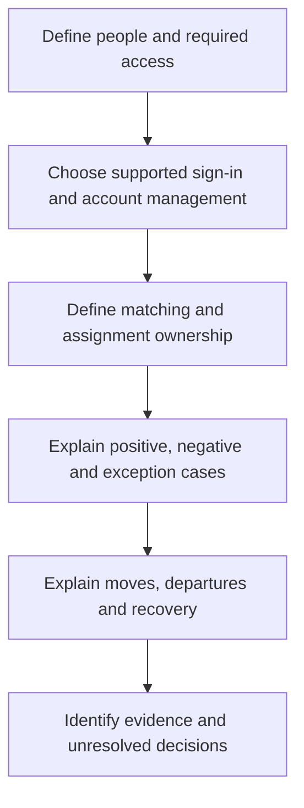

# Onboarding a new application

“Connect our new app to Okta” contains several decisions. Which people need it? How will the app recognize them? Who manages its accounts, and what should happen when access ends?

Use this framework after [Day 14](../lessons/day-14-requirements-and-responsibilities.md). It is a theory exercise in explaining a proposed design and its evidence. No tenant or configuration work is required.

## 1. Define the requirement and the system boundary

An **Okta organization**, often called an **org** or tenant, is a separate Okta environment with its own users and configuration. An **application integration instance** is a particular configured connection within that org. Two connections to the same product can point to different target environments and have different settings.

Record the intended org, integration instance and target environment before comparing evidence. A successful operation against a test instance does not establish the production outcome.

Ask which employees and contractors qualify, which system owns the deciding attributes, which application permissions they need, and when access starts or ends. Name the business approver, identity-data owner, IAM owner and application owner. A department does not automatically establish an application role.

## 2. Choose the supported sign-in method

Establish what the particular app and connector support. For SAML, explain the trusted issuer, validation requirements, destination and matching rule. For this course's OIDC web-client model, the browser returns a code and the backend exchanges it for tokens, validates the response and establishes an application session. Do not copy these settings into a connector that uses a different protocol.

Revisit [SAML](../lessons/day-08-saml.md) or [OIDC](../lessons/day-09-oidc.md) for the full flow.

## 3. Separate account management from sign-in

Identify who creates, updates and disables accounts. If provisioning is supported and configured, establish its actual operations and credentials. Otherwise, explain the responsible manual or external process and the evidence it returns. Signing in does not universally create an account, and an assignment is not proof of successful provisioning.

For an existing account, establish ownership before linking or creating anything. See [SCIM](../lessons/day-10-scim.md) and [matching](../lessons/day-11-imports-and-matching.md).

## 4. Distinguish the identifiers

| Decision | What to establish |
|---|---|
| SAML sign-in matching | The app's configured identity rule; in Day 8, NameID must match the intended Salesforce username. An email-looking value is not automatically correct. |
| OIDC identity | Validate the token and use the issuer (`iss`) and subject (`sub`) together for the stable identity within that issuer. Email is not an equivalent guaranteed stable key. |
| Initial provisioning lookup | The connector's documented matching criteria; the Projects SCIM example looks up `userName` and checks ownership. |
| Subsequent target operations | The confirmed target-assigned resource identifier, such as Projects `id`, associated with the intended Okta user. |

Consider what happens when a login or email changes and when a lookup finds a conflicting account. Do not infer ownership from one matching string. See [OIDC claim stability](https://openid.net/specs/openid-connect-core-1_0.html#ClaimStability) and [Okta SCIM operations](https://developer.okta.com/docs/api/openapi/okta-scim/guides/scim-20).

## 5. Explain membership and exceptions

Write the eligibility condition in plain words first. A group rule can manage membership from attributes; an existing directory group or an approved manually maintained group may suit a different requirement. Name the membership owner and the app assignment attached to that group.

A direct assignment or a governed exception group can represent an approved exception. State the approver, scope, owner and end condition. Neither mechanism automatically supplies those controls. Check surviving assignment paths when normal eligibility ends. See [Day 5](../lessons/day-05-groups-and-assignments.md).

## 6. Compare several evidence cases

For this fictional design variant, Northbridge Projects is intended for Sales employees. A contractor needs a separately approved, limited exception. Maya's move to Finance would end ordinary access under this variant; this does not change the different approved Projects outcome in Day 12.

| Case | Required reasoning |
|---|---|
| Eligible Sales employee | Explain assignment, intended account, successful sign-in and permitted actions with separate evidence. |
| Ineligible Finance employee | Explain why the ordinary assignment is absent and why an old account or session still needs checking. |
| Priya's contractor exception | Establish sponsor approval, limited permission, assignment path and end condition; preserve her Okta-managed source model. |
| Maya moves out of Sales | Inspect every surviving assignment, target account and relevant session against the variant's removal requirement. |
| Existing account or rehire | Verify ownership and intended reuse before assuming a new account is needed. |
| Departure or exception expiry | Explain the Okta action, per-app removal results and separate session outcome. |

One successful example supports only its observed path. It does not establish the negative, exception or lifecycle cases.

## 7. Explain maintenance, shared impact and recovery

Identify other apps or users affected by shared groups and policies. State who owns a failed change and what evidence would show that both the configuration and its unintended effects have been corrected. Restoring a setting alone does not remove accounts or sessions already created.

Two short comparisons help locate a maintenance failure:

- **SAML credential or field mismatch:** a reported expired or untrusted signing certificate calls for comparing the received signature's credential, validity and configured trust. A reported audience mismatch calls for comparing the audience with the intended application identifier. Both can reject sign-in; they require different evidence and owners. Keep validation enabled.
- **Service credential or user authentication:** a provisioning API's rejected integration credential concerns the connection acting on accounts. It does not establish that Maya's password or authenticator is wrong. Identify the caller, endpoint and exact error before proposing a credential change.

Record owners for certificate and service-credential maintenance, expected expiry or rotation events, and the supported recovery process. No secret values belong in the learning notes.

## State what the evidence supports

A clear explanation connects the approved population, identifiers, assignment paths, account operations, sign-in, permissions and removal behavior. It also names unresolved questions and the evidence needed to answer them. That is an assessed design explanation; operational deployment readiness requires the organization's own validation and change process.

[Day 14 practice](../exercises/day-14.md) · [Learning path](../learning-path.md) · [Course home](../index.md)
