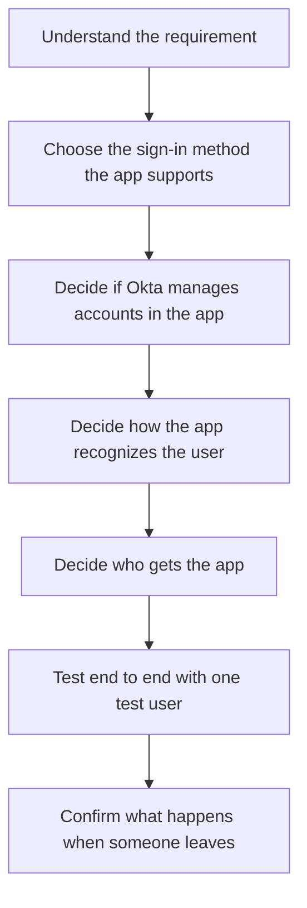

# Onboarding a new application

One of the most common projects you will get is "we bought a new app, connect it to Okta." The exact clicks differ for every app. The thinking does not. Here is how to work through it from start to finish.

## 1. Understand the requirement

Before anything technical, get the real request. A line like "give Sales the new app" is not enough yet. Ask:

- Which people exactly? Employees only, or contractors too?
- How are those people identified? Which attribute, and which system owns it?
- Should they get it automatically, or only when they ask?
- What should they be able to do inside the app?
- What happens when they change teams or leave?

You cannot design access until you know who, how, and when.

## 2. Choose the sign-in method

Find out what the app supports for single sign-on. Usually it is SAML or OIDC. Pick the one the app documents. You are deciding how Okta will prove to the app who the user is. Both send the app a trusted message about the user; their formats and checks differ.

## 3. Decide if Okta manages accounts in the app

Sign-in and account management are separate choices. Ask whether Okta should create and update accounts in the app, often through SCIM, or whether accounts already exist or are made another way. Do not assume every app supports provisioning, and do not assume signing in creates an account.

## 4. Decide how the app recognizes the user

The app needs to match the incoming person to an account on its side. For SAML this is usually the NameID. For OIDC it is the subject or a claim. For provisioning it is the userName. Decide which value identifies the user, and make sure the value Okta sends is the value the app expects.

## 5. Decide who gets the app

For access that everyone in a group should have, use a group rule so the right people are added automatically. For one-off exceptions, use a direct assignment. Write down the rule in plain words first, for example "Sales employees, not contractors," then build it.

## 6. Test end to end with one test user

Do not declare it done after one green screen. Walk the whole path with a single test user:

- The user is assigned the app.
- An account exists in the app, with the right attributes.
- The user can sign in to the app.
- The user can do what they are supposed to do, and not more.

Check each step with its own evidence.

## 7. Confirm what happens when someone leaves

Access is only half the job. Confirm the leaver path too. When the person is deactivated, check that the app account is disabled and that no stray access path remains. This is the part people forget, and it is the part auditors ask about.

## Before you call it done

- The right people get the app, and the wrong people do not.
- Sign-in works, and you have seen it work.
- The account exists in the app with correct attributes.
- Removing the person removes the access.
- You wrote down what you configured and why.

If you can tick all five with evidence, the integration is ready. If you are guessing on any of them, you are not done yet.
