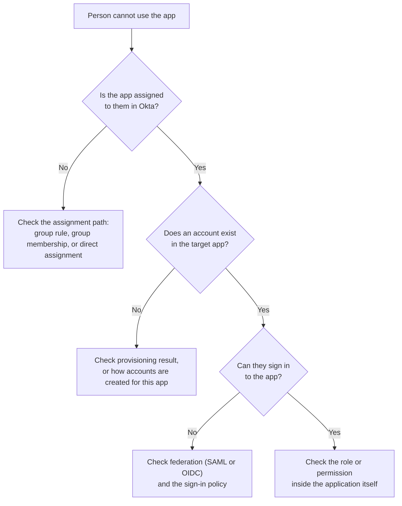
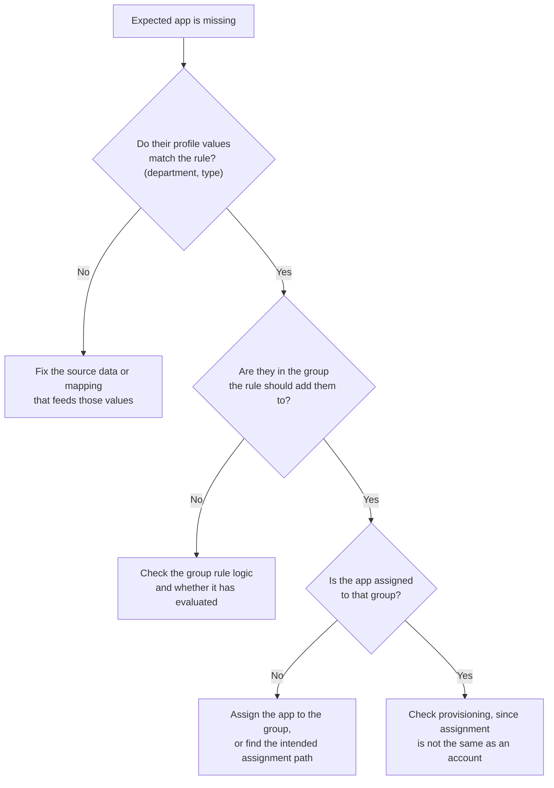
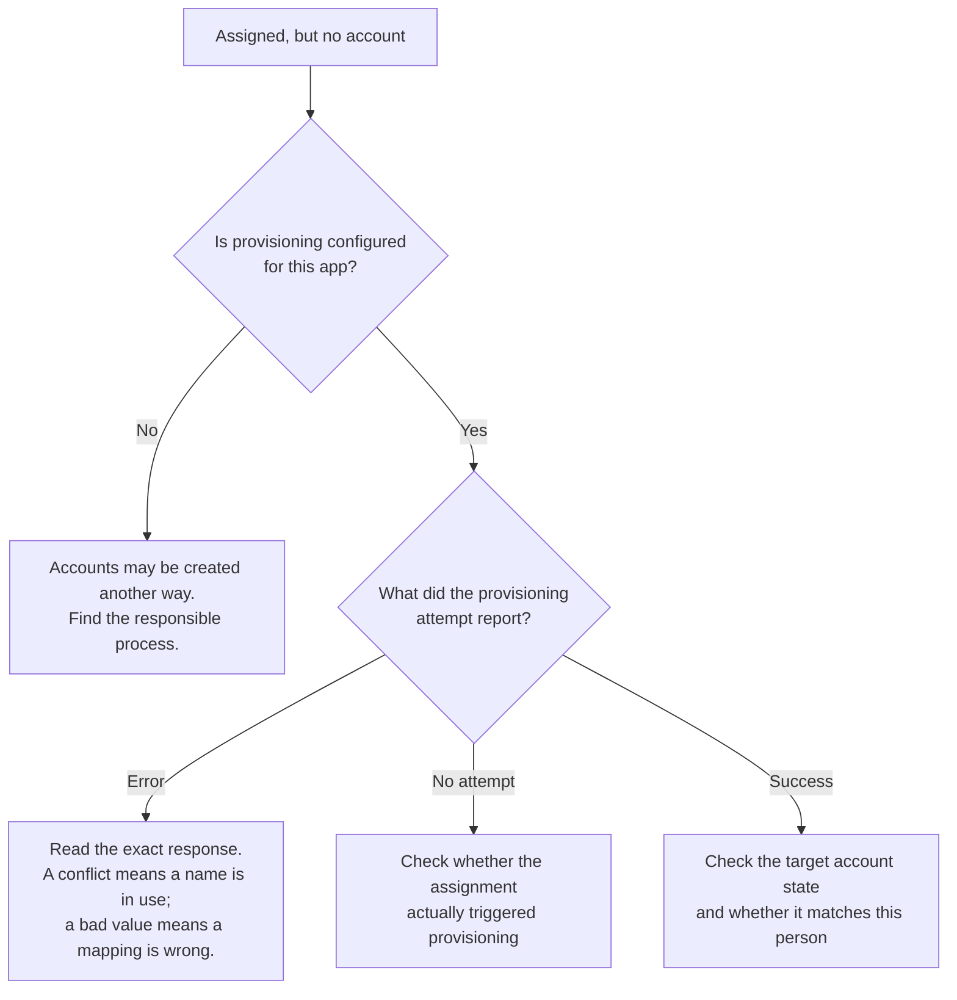
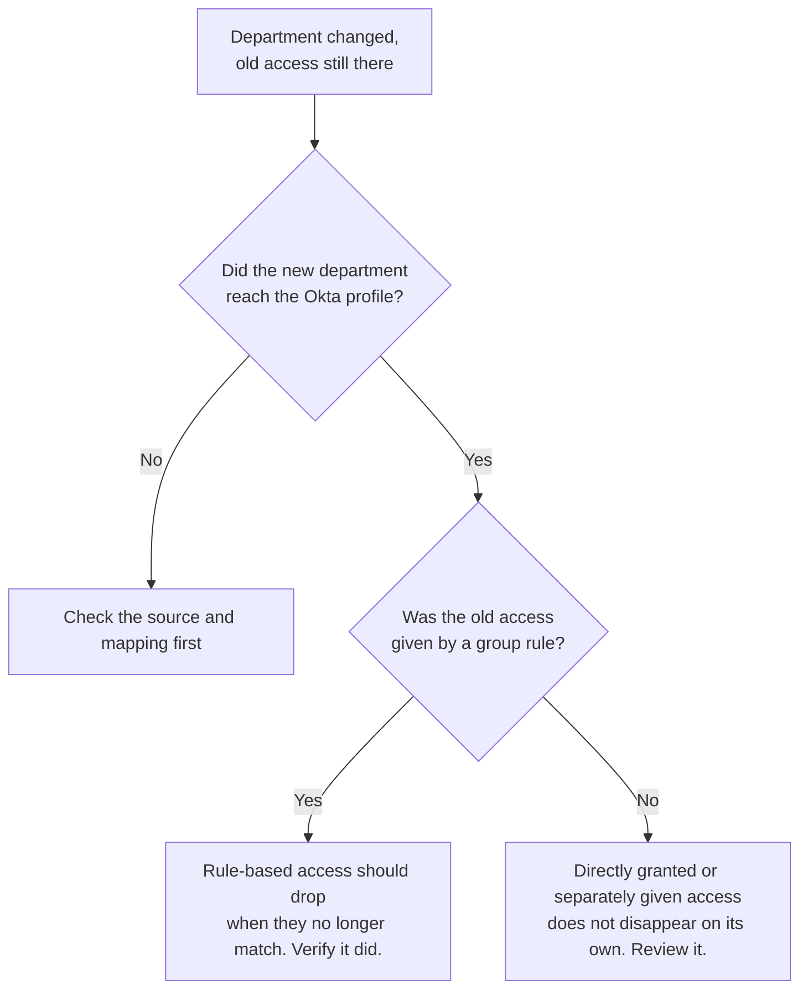
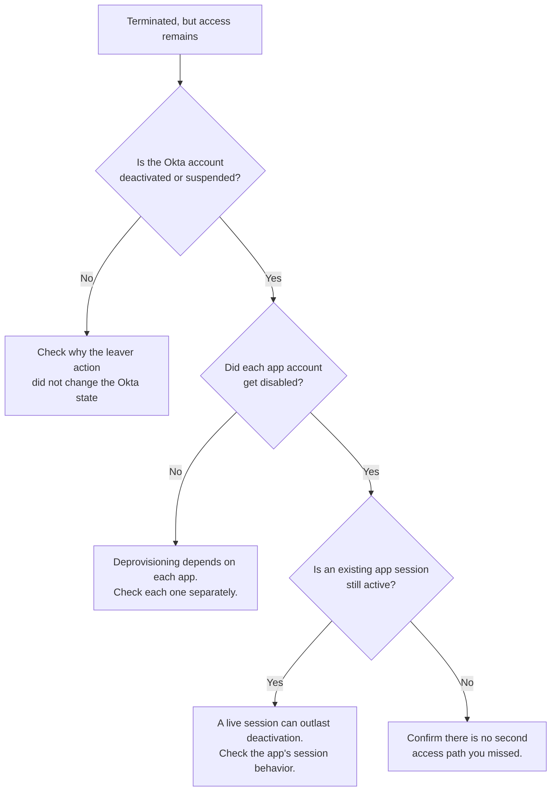
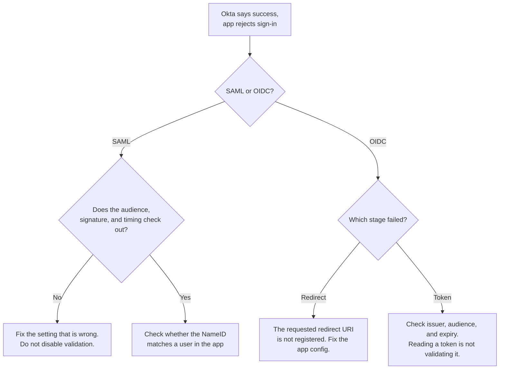
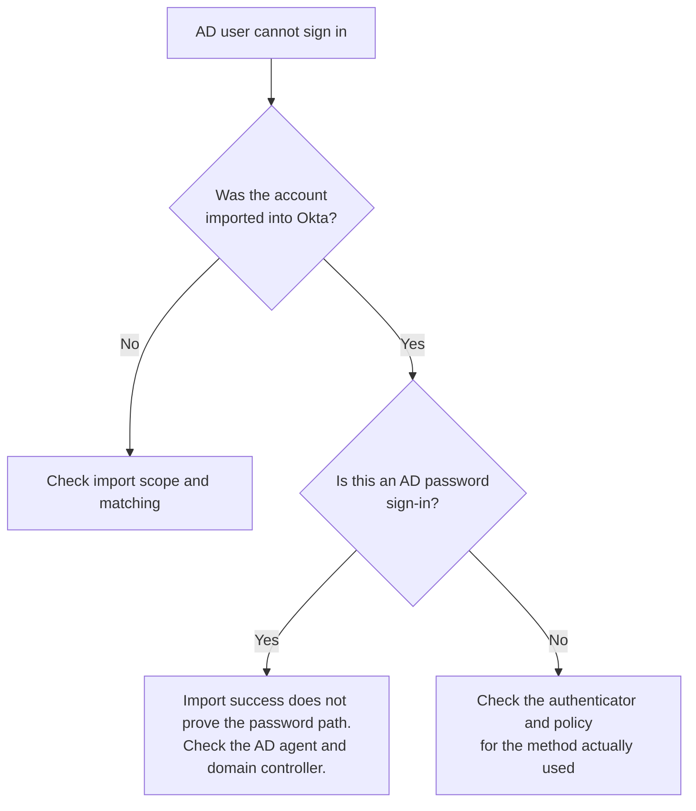

# Troubleshooting playbook

Keep this page open when you work a real ticket. It does not replace the lessons. It gives you a starting path for the most common problems, and it reminds you what each check actually proves.

Start every ticket the same way:

1. What should have happened for this person and this app?
2. What actually happened? Get the real symptom, not a vague "it does not work."
3. Where did expectation and reality first differ?
4. What evidence proves it, and what does that evidence not prove?

Then pick the matching path below. Each path tells you where to look first, not what to change blindly. Confirm the cause with evidence before you fix anything.

## The person cannot use an application

Remember: an Okta sign-in success only proves they reached Okta. It does not prove the app account exists or that the app let them in.

## The person is not getting the application

## Assigned in Okta, but no usable account in the app

## Moved department, but old access remains

## Left the company, but still has access

## The application rejects the sign-in

## An AD-linked user cannot sign in

A last reminder. "Not checked yet" is not the same as "not there." If you have not looked at the assignment, do not report it as missing. Look, then report what the evidence shows.
