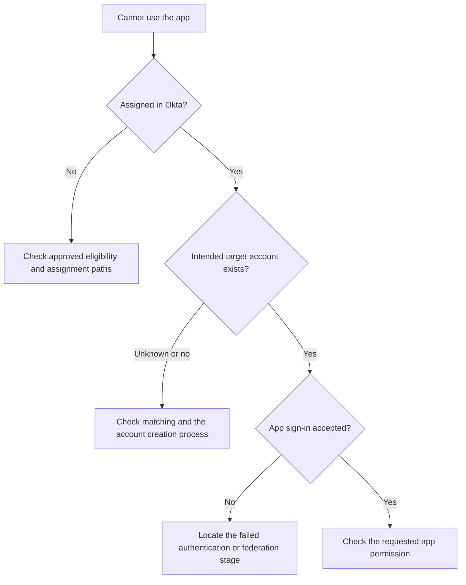
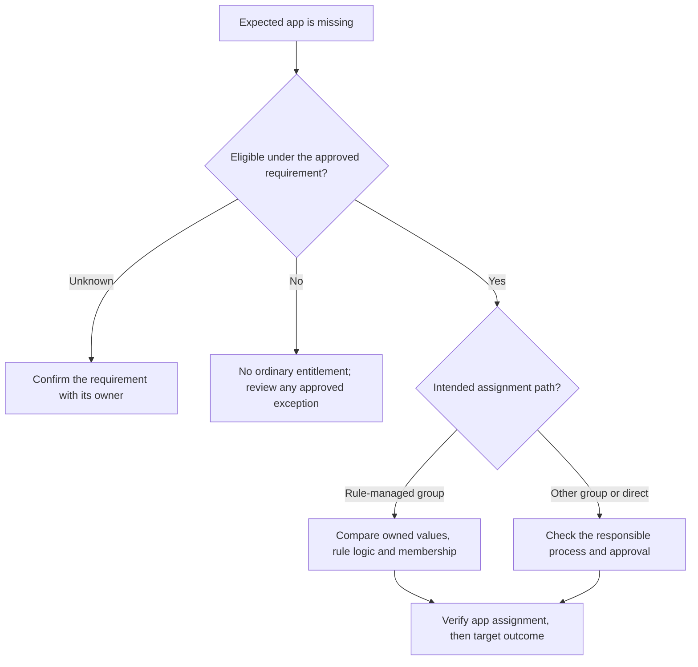
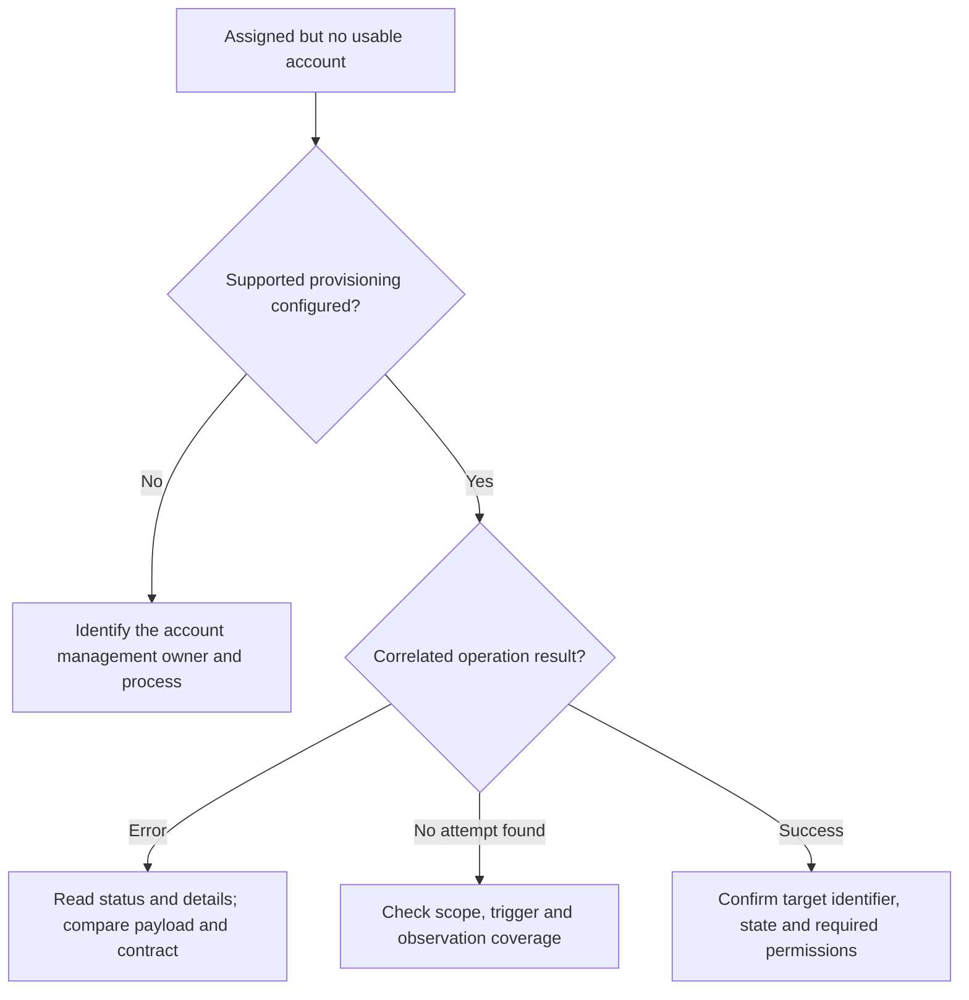
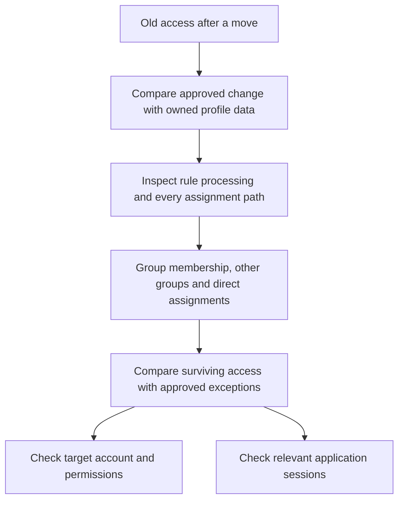
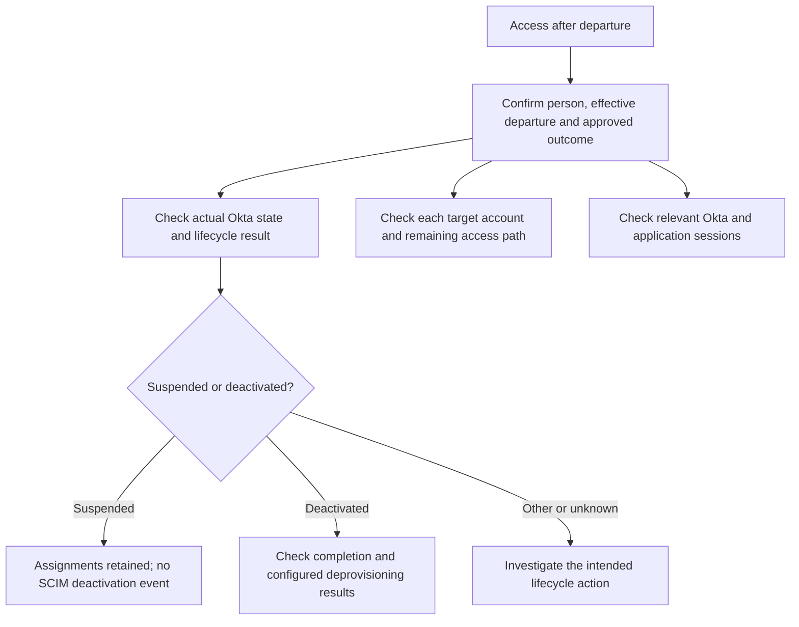
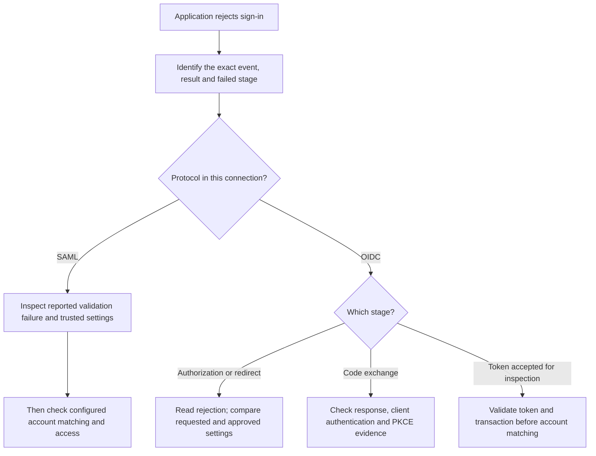
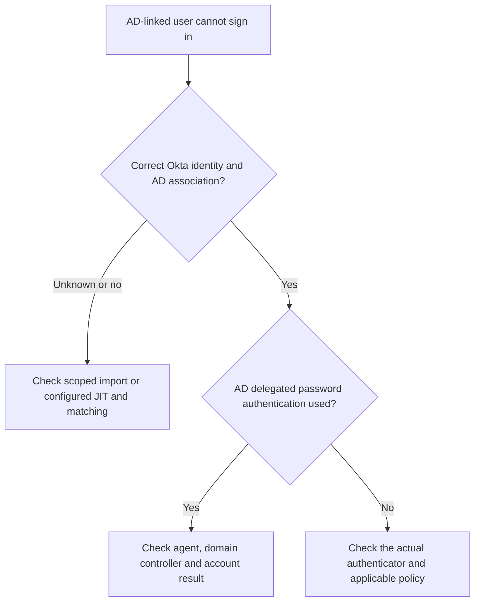

# Troubleshooting playbook

Use these paths to reason through a supplied case after reading the relevant lessons. Each path identifies evidence to seek; it cannot establish a cause from the symptom alone. Start with Days 1–5, then use the protocol and lifecycle sections after those lessons.

Start every ticket the same way:

1. What should have happened for this person and this app?
2. What actually happened? Get the real symptom, not a vague "it does not work."
3. Where did expectation and reality first differ?
4. What evidence proves it, and what does that evidence not prove?

Then pick the matching path below. Each path tells you where to look first, not what to change blindly. Confirm the cause with evidence before you fix anything.

## The person cannot use an application

Name the event precisely. A successful authentication result establishes authentication for that attempt. An SSO issuance result establishes a different step. Neither alone proves that the application accepted the sign-in or granted the requested permission. See [Day 2](../lessons/day-02-requests-and-evidence.md).

## The person is not getting the application

Correct profile data can mean that a person is ineligible. Do not alter it to force a rule match. For an eligible person, compare the approved condition with the responsible source, mapping, group membership and assignment. See [Day 5](../lessons/day-05-groups-and-assignments.md).

## Assigned in Okta, but no usable account in the app

For SCIM, read the HTTP status, `scimType`, and error detail together. A uniqueness conflict does not identify the conflicting field or its owner by itself. An invalid value can reflect source data, a mapping, missing required data, or a target contract mismatch. Compare the source, app profile, actual request and target requirements before proposing a correction. See [Day 10](../lessons/day-10-scim.md) and [SCIM error handling](https://www.rfc-editor.org/rfc/rfc7644.html#section-3.12).

## Moved department, but old access remains

Removing one group path does not remove a surviving direct assignment or another group path. Preserve access that remains approved and investigate each remaining path. See [Day 12](../lessons/day-12-joiners-movers-leavers.md).

## Left the company, but still has access

These are separate checks: an unresolved target account must not postpone investigating a reported live session. Suspension and deactivation have different effects; neither observation establishes every target outcome. [Okta SCIM guidance](https://developer.okta.com/docs/api/openapi/okta-scim/guides/scim-20) states that suspension does not send a deprovisioning event. Use [Day 12](../lessons/day-12-joiners-movers-leavers.md) for lifecycle reasoning and [Day 13](../lessons/day-13-policies-and-sessions.md) for session behavior.

## The application rejects the sign-in

For a confirmed redirect-URI rejection, compare the requested URI, registered URI and approved destination. That comparison identifies which configuration needs correction; the symptom alone does not. A code-exchange error is distinct from ID token validation. SAML validation includes issuer, signature, audience, destination and timing; inspect the actual rejection without disabling validation. Continue with [Day 8](../lessons/day-08-saml.md) or [Day 9](../lessons/day-09-oidc.md).

## An AD-linked user cannot sign in

An earlier import is not universal proof or a universal prerequisite for every configured AD sign-in route. Just-in-time (JIT) creation, where enabled and applicable, is another route to inspect. Import success does not establish delegated-authentication health. See [Day 6](../lessons/day-06-active-directory.md).

A last reminder. "Not checked yet" is not the same as "not there." If you have not looked at the assignment, do not report it as missing. Look, then report what the evidence shows.

[Course home](../index.md)
